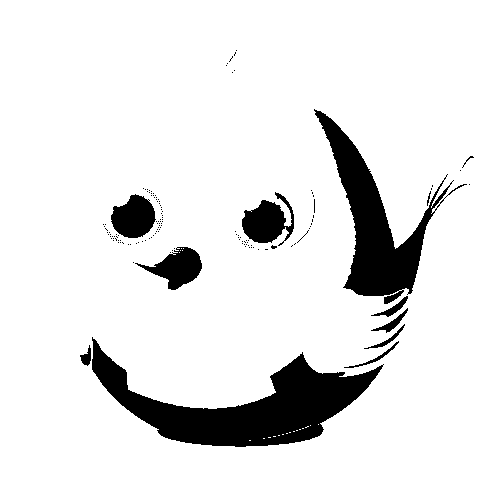

# <center>**信息隐藏技术实验报告**</center>

## <center>**Lab1 可视密码学**</center>

## <center> **网络空间安全学院 信息安全专业**</center>

## <center> **2112492 刘修铭 1028**</center>

# 一、题目

1. 实现二值图像的（2,  2）的可视密钥分享方案
2. 有能力同学可以做灰度图像的、彩色图像的
3. 还可以做（t，n）方案
4. 叠像术

其中，1 必做，其它都是选做的


# 二、实验要求

编程实现，写出实验报告，含程序代码和截图，word 或 pdf 格式，并做 ppt 展示

​	

# 三、实验原理

## （一）可视密码学

秘密共享是针对密钥管理提出的一种密码技术。可视密码学方案实际上是一种秘密共享方案，即使是一个具有无穷计算能力的攻击者，也不能再拥有的之秘密数量少于一个给定值时获得关于秘密图像的任何信息。

秘密及成员所持有的密文不是一串数值而是图像。在还原秘密时，不需要额外的设备及运算辅助，直接由人类视觉系统来解密。

可视化密码是一种依靠人眼解密的秘密共享方法：将一个秘密图像加密成 n 张分享图像，由 n 个人分比如保管，解密时只需要 k' (k‘ >= k) 个人将各自的分享图像叠加，秘密图像就会呈现，而少于 k 个人无法获得秘密图像的任何一点信息。

### 1. Shamir 的二值信息分存方案

原始图像的每个黑或白像素被 2 个子块所替代，其中每个子块由 $2\times2$ 个黑、白像素构成，这样就生成两幅膨胀了的图形，这两幅图像的叠加得到放大了 4 倍，且对比度有所降低的原始图像。


作为一个二值图像，原始文字是白底黑字，把每一个像素扩展成 $2\times2$（或 $n\times n$），用只有一个白像素的新图块代表原图的白像素块，用 4 个像素均为黑色的新图块代表原图的黑像素块。基于此定义，可以得到如下的分存方案：


其中，我们根据要加密的秘密图像的像素的黑或白，从上面的三种方案中随机选择一个为伪装图像 1 的像素赋值，然后根据此为伪装图像 2 对应位置的像素进行赋值处理，以此得到两个新的伪装图像，其图像尺寸是待加密的秘密图像的两倍。得到两个伪装图像后，我们将两个图像进行叠加，即可得到原始的待加密的秘密图像，但由于是用三黑一白代替原来的白色，故而其对比对会有所下降。

### 2. 灰度图像的可视密码技术实现

连续调图像通常指在一幅图像上，其由淡到浓或由浅到深的色调变化是以单位面积成像物质颗粒密度来构成的，呈现无极变化。而半色调图像通常是指经过特殊加工后的印刷品上的由浅到深或由淡到浓的色调变化是由网点大小来表现的，不能无极变化。

对于灰度图像处理而言，首先需要将灰度图像进行半色调化处理，将其转换成二值图像，然后即可按照二值图像进行处理。

半色调技术是一种将连续调图像转换成黑白图像的方法。此处借助误差扩散法实现。误差扩散法首先阈值量化图像像素，然后将量化过程中产生的误差分配给周围像素点。

* 如果输入的像素值小于等于 127（比较接近黑色），则输出 0（黑色）；如果大于 127（比较接近白色），则输出 255（白色）

* 误差 = 输入像素值 - 输出

* 接着将误差扩散到像素的 4 个待处理的邻点，分别是右方、右下方、正下方和左下方像素点。

  

### 3. 彩色图像可视密码技术实现

彩色图像较前面二者相比是由 R、G、B 三个分量构成，是一个三维矩阵。处理时，将每个分量当作一张图片按照灰度图像进行半色调处理，对每个分量的图片对应分存到两张伪装图像的对应分量上，最后将其进行合并，即可得到待加密的秘密图像。

### 4. (t, n) 可视密码学技术

假设可以将秘密分成 n 个不同的分存图像，然后原始图像只能通过不同分存图像的组合来恢复。为了实现这一目标，采用 Shamir 阈值方案中的多项式。此处以灰度图像进行实现。

由于灰度图像的值在 0 到 255 之间，因此选择素数 257 作为最接近 255 的素数。然后将大小为 $H\times W$ 的图像分成 m 个部分，每个部分包含 t 个像素。

对于部分 k，定义多项式 $s_k(x)=s_0+s_1x+...+s_{t-1}x^{t-1}(mod\ p)$，其中 $s_0,s_1,...,s_{t-1}$ 对应每个像素的值。

根据此多项式及给定的 $x$，即可得到一个包含 $s_0(x),s_1(x),...,s_m(x)$ 共 m 个数的数组 $A_x$，将其转换成矩阵，即可得到一个 $a\times b$ 大小的矩阵，即分存图像。

选择不同的 $x$，重复多次，即可得到不同的分存图像。


## （二）叠像术

可视密码学分存得到的伪装图像是黑白像素块，没有什么“信息”，攻击者可以很自然地想到上面存在加密。相比而言叠像术则是使用有实际含义的图片作为“密钥”，密钥叠加得到秘密图像。由于密钥图像是有实际含义的，故而较可视密码学而言，攻击者更不容易发现，某种意义上可以避免受到攻击。

叠像术中使用三张尺寸相同的图片完成。

### 1. 二值图像叠像术实现

对于三张图中一一对应的每个像素点：待加密的秘密图像像素点可能为黑或白，密钥子图 1 像素点可能为黑或白，密钥子图 2 像素点也可能为黑或白。故而有如下 8 种情况：


对于原始的黑或白像素，我们可以看到，无论是分存成的像素块是黑还是白，经过叠加后都可以叠成得到与原色的像素相同的像素块。与可视密码学相同的是，这里分存块的黑也不是全黑，而是三黑一白的相对黑。但叠加后得到的黑色像素则为全黑。


经过列举比较，得到符合前面规定的如下的分存方案：


### 2. 灰度图像叠像术的实现

与前面可视密码学技术相似的，首先需要将要隐藏的灰度图像和两幅密钥图像进行半色调化处理，接着按照二值图像处理即可。

### 3. 彩色图像叠像术的实现

与前面可视密码学技术相似，首先将图片进行半色调处理，接着将三个分量按照灰度图像单独处理，然后再进行分存叠加即可。


# 四、实验过程（含主要源代码）

## （一）可视密码学 (2, 2) 可视密钥分享方案

### 1. 二值图像

首先定义了一个分存函数 `img_divide`，按照前面的分存方案，将输入的 `img` 分存到 `img1` 和 `img2` 中。

* 首先将两个分存图像按照 `img` 的 size 进行初始化，得到全 1（纯白）的图像

  > 此处的全 1 实现有助于后面编程的实现：对于黑色点而言，只需要将其进行赋 0 处理即可，而不是 4 个点每次都单独赋值。

* 接着遍历原始图像，按照生成的随机数，对两个分存图像按照前面约定的分存方案进行分存处理，即对像素点赋 0、1 值

```matlab
% img_divide: Divide an input image into two images, img1 and img2, by applying a specific pattern.
%
% Inputs:
%   img - the input image to be divided
%
% Outputs:
%   img1 - the first divided image
%   img2 - the second divided image
%
function [img1, img2] = img_divide(img)

    img_size = size(img);
    disp("The size of the input image is: ");
    disp(img_size);

    x = img_size(1); % x 为 img_size 的第一个参数
    y = img_size(2); % y 为 img_size 的第二个参数
    img1 = 255 * ones(2 * x, 2 * y); % 将 img1 初始化为全白图像
    img2 = 255 * ones(2 * x, 2 * y); % 将 img2 初始化为全白图像
    disp("The size of the img1 is: ");
    disp(size(img1));
    disp("The size of the img2 is: ");
    disp(size(img2));

    for i = 1 : x
        for j = 1 : y
            new_img_row = 2 * (i - 1) + 1;
            new_img_col = 2 * (j - 1) + 1;
            key = randi(3);

            switch key
                case 1
                    img2(new_img_row, new_img_col) = 0;
                    img2(new_img_row, new_img_col + 1) = 0;

                    if img(i, j) == 1 % original_img is white
                        img1(new_img_row, new_img_col + 1) = 0;
                        img1(new_img_row + 1, new_img_col + 1) = 0;
                    else % original_img is black
                        img1(new_img_row + 1, new_img_col) = 0;
                        img1(new_img_row + 1, new_img_col + 1) = 0;
                    end

                case 2
                    img2(new_img_row, new_img_col) = 0;
                    img2(new_img_row + 1, new_img_col + 1) = 0;

                    if img(i, j) == 1 % original_img is white
                        img1(new_img_row, new_img_col) = 0;
                        img1(new_img_row + 1, new_img_col) = 0;
                    else % original_img is black
                        img1(new_img_row, new_img_col + 1) = 0;
                        img1(new_img_row + 1, new_img_col) = 0;
                    end

                case 3
                    img2(new_img_row, new_img_col) = 0;
                    img2(new_img_row + 1, new_img_col) = 0;

                    if img(i, j) == 1 % original_img is white
                        img1(new_img_row, new_img_col) = 0;
                        img1(new_img_row, new_img_col + 1) = 0;
                    else % original_img is black
                        img1(new_img_row, new_img_col + 1) = 0;
                        img1(new_img_row + 1, new_img_col + 1) = 0;
                    end

            end
        end
    end

end
```

接着定义了一个 `merge` 函数，用于将两个图像进行合并叠加。由于是二值图像，均为 0 或 1，故而此处进行与运算即可

* 1 表示白，0 表示黑，只有当两个均为白时，叠加得到的像素点才为白，和与运算的逻辑相同

```matlab
% img_merge: Merge two images using bitwise AND operation.
%
% Input Arguments:
%   - img1: First input image.
%   - img2: Second input image.
%
% Output Argument:
%   - img: Merged image with the same size as img1 and img2.
%
function img = img_merge(img1, img2)
    img_size = size(img1); % 两张图像的尺寸一致，故而此处以 img1 的 size 作为 img 的 size
    disp("The size of the img1 is: ");
    disp(img_size);
    
    %%
    % 该方法无法准确赋值，故而使用后面的分别进行赋值
    % [x, y] = img_size; % x 为 size 的第一个参数，y 为 size 的第二个参数
    %%
    
    x = img_size(1); % x 为 img_size 的第一个参数
    y = img_size(2); % y 为 img_size 的第二个参数
    disp("The first size of the img1 is: ");
    disp(x);
    disp("The second size of the img1 is: ");
    disp(y);

    img = 255 * ones(x, y); % 将 img 初始化为全白图像
    disp("The size of the merged img is: ");
    disp(size(img));
    
    for i = 1 : x
        for j = 1 : y
            img(i, j) = img1(i, j) & img2(i, j);
        end
    end

    disp("The size of the merged img is: ");
    disp(size(img));

end
```

最后定义了一个 `main` 函数，对用到的数据进行一定的初始化，并综合调用前面编写的两个函数，对图像进行分存即叠加。

* 由于 Matlab 运行环境的影响，笔者建议使用**绝对路径**进行图片选择。

```matlab
% main() is the main function of the visualCryp program.
function main()

    clc;
    clear all;
    close all;
    
    img_path = input("Please use the absolute path to input the image to be processed: ", 's');
    % img_path = "/Users/lxmliu2002/Desktop/matlab/lab1/pic/NKU70.bmp";

    original_img = imresize(imread(img_path), 0.25);
    disp("The size of the original image is: ");
    disp(size(original_img));
    figure;
    imshow(original_img);
    title('original\_img');
    imwrite(original_img, './pic/Visual_Cryptography_Binary/original_img.bmp');

    [img1, img2] = img_divide(original_img);
    disp("The size of the divided image is: ");
    disp(size(img1));
    disp("The size of the divided image is: ");
    disp(size(img2));
    figure;
    imshow(img1);
    title('img1');
    imwrite(img1, './pic/Visual_Cryptography_Binary/img1.bmp');
    figure;
    imshow(img2);
    title('img2');
    imwrite(img2, './pic/Visual_Cryptography_Binary/img2.bmp');

    merged_img = img_merge(img1, img2);
    disp("The size of the merged image is: ");
    disp(size(merged_img));
    figure;
    imshow(merged_img);
    title('merged\_img');
    imwrite(merged_img, './pic/Visual_Cryptography_Binary/merged_img.bmp');

    % Check if the size of original_img and merged_img are the same
    if isequal(2 * size(original_img), size(merged_img))
        disp('Congratulations');
    else
        error('The size of the original image and the merged image do not match');
    end
end
```

### 2. 灰度图像

未避免报告过于冗长，此处仅介绍与前面二值图像不同的处理地方。

较二值图像处理而言，此处主要引入了半色调化处理将灰度图像处理成黑白二值图像。代码中，定义了 `img_halftone` 函数，按照前面提到的误差扩散法原理，对图像进行处理。

```matlab
% img_halftone(gray_img): This function performs halftoning on a grayscale image using error diffusion.
%
% Input:
% - gray_img: The input grayscale image.
%
% Output:
% - img: The halftoned image.
%
function img = img_halftone(gray_img)
    img_size = size(gray_img);
    disp("The size of the gray_img is: ");
    disp(img_size);
    
    %%
    % 该方法无法准确赋值，故而使用后面的分别进行赋值
    % [x, y] = img_size; % x 为 size 的第一个参数，y 为 size 的第二个参数
    %%
    
    x = img_size(1); % x 为 img_size 的第一个参数
    y = img_size(2); % y 为 img_size 的第二个参数
    disp("The first size of the img1 is: ");
    disp(x);
    disp("The second size of the img1 is: ");
    disp(y);

    for m = 1 : x
        for n = 1 : y
            if gray_img(m, n) > 127
                out = 255;
            else
                out = 0;
            end

            error = gray_img(m, n) - out;

            if n > 1 && n < 255 && m < 255
                gray_img(m, n + 1) = gray_img(m, n + 1) + error * 7 / 16.0;  % 右方
                gray_img(m + 1, n) = gray_img(m + 1, n) + error * 5 / 16.0;  % 下方
                gray_img(m + 1, n - 1) = gray_img(m + 1, n - 1) + error * 3 / 16.0;  % 左下方
                gray_img(m + 1, n + 1) = gray_img(m + 1, n + 1) + error * 1 / 16.0;  % 右下方
                gray_img(m, n) = out;
            else
                gray_img(m, n) = out;
            end
        end
    end

    img = gray_img;

end
```

`main` 函数中则需再调用该函数即可，在此不做代码展示。

### 3. 彩色图像

较前面的灰度图像、二值图像而言，彩色图像主要是需要对三个分量进行处理。

代码实现上并没有定义其他函数，而是主要对 `main` 函数的实现逻辑进行微调，使用一个小循环对图像的三个分量进行调整。核心代码如下：

```matlab
for i = 1 : 3
    halftone_img(:, :, i) = img_halftone(original_img(:, :, i));
    [img1(:, :, i), img2(:, :, i)] = img_divide(halftone_img(:, :, i));
    merged_img(:, :, i) = img_merge(img1(:, :, i), img2(:, :, i));
end
```


## （二）可视密码学 (t, n) 可视密钥分享方案

此处主要包含如下模块：

1. `main` 函数：读取原始图像数据，然后将数据重新排列成二维矩阵，按照指定的块数 `blocks` 进行切分，形成`prepared_img`。接着调用 `img_shadow` 生成分存图像 `shadow_img`，并根据选定的用户列表 `selected_users` 从分存图像中提取所需的分存图像。最后调用 `img_merge` 函数将所需的分存图像合并，得到还原的图像 `merged_img`

2. `img_shadow` 函数：对每一列数据，根据秘密共享方案生成分存图像，使用多项式的幂运算和模运算。返回生成的分存图像 `shadow_img`

3. `show_shadow_imgs` 函数：遍历 `shadow_img` 的每一列，显示并保存为 bmp 文件

4. `img_required_shadow` 函数：选定的用户列表，从 `shadow_img` 中提取相应的列，形成`required_shadow_img`

5. `img_merge` 函数：使用线性方程组求解的方式，根据选定的用户列表还原原始图像

6. 除此之外，还实现了几个辅助计算函数：
   1. `get_mod` 函数：计算有理数的模运算，返回模运算结果

   2. `power_mod` 函数：计算幂运算的模运算，返回模运算结果

   3. `inv_mod_n` 函数：计算模n的数的模反元素，即模逆，返回模逆。如果模逆不存在，返回空数组


```matlab
% main() is the main function of the t&n_imageSharing program.
function main
    clear;
    close all;

    height = 256;
    width = 256;
    blocks = 4;
    polynomial_degree = 8;
    selected_users = [1, 3, 5, 8];
    modulo_base = 257;

    subWidth  = width / blocks ^ (0.5);
    subHeight = height / blocks ^ (0.5);

    img_path = input("Please use the absolute path to input the image to be processed: ", 's');
    % img_path = "/Users/lxmliu2002/Desktop/matlab/lab1/pic/lena.bin";

    original_img = fopen(img_path, 'rb');
    liner_img = fread(original_img, 'uint8');
    original_img = uint8(reshape(liner_img, height, width)');
    figure;
    imshow(original_img);
    title('original\_img');
    imwrite(original_img, './pic/t&n/original_img.bmp');

    prepared_img = reshape(liner_img, [], blocks);
    shadow_img = img_shadow(prepared_img, polynomial_degree, modulo_base);
    show_shadow_imgs(shadow_img, subWidth, subHeight);
    required_shadow_img = img_required_shadow(shadow_img, selected_users);

    merged_img = img_merge(required_shadow_img, selected_users, height, width, modulo_base);
    figure;
    imshow(uint8(merged_img));
    title('merged\_img');
    imwrite(uint8(merged_img), './pic/t&n/merged_img.bmp')
end

% img_shadow: Generates a shadow image using secret image sharing scheme.
%
%   Inputs:
%   - prepared_img: The prepared image to generate the shadow image from.
%   - polynomial_degree: The degree of the polynomial used in the scheme.
%   - modulo_base: The base value used for modulo operation.
%
%   Outputs:
%   - shadow_img: The generated shadow image.
%
function shadow_img = img_shadow(prepared_img, polynomial_degree, modulo_base)
    % Convert the image size to int32
    imageSize = int32(size(prepared_img));
    
    % Convert the prepared image, polynomial degree, and modulo base to int32
    prepared_img = int32(prepared_img);
    polynomial_degree = int32(polynomial_degree);
    modulo_base = int32(modulo_base);
    
    % Initialize the shadow image matrix
    shadow_img = int32(zeros(imageSize(1), polynomial_degree)); 
    
    % Generate the shadow image
    for i = 1 : polynomial_degree
        for j = 1 : imageSize(2)
            shadow_img(:, i) = shadow_img(:, i) + mod(prepared_img(:, j) * i ^ (j - 1), modulo_base);
        end
    end
    
    % Apply modulo operation to the shadow image
    shadow_img = mod(shadow_img, modulo_base);
end

% show_shadow_imgs - Displays and saves shadow images.
%
% Inputs:
% - shadow_img: A matrix representing the shadow images. Each column of the matrix represents a shadow image.
% - subWidth: The width of each sub-image in the shadow images.
% - subHeight: The height of each sub-image in the shadow images.
%
function show_shadow_imgs(shadow_img, subWidth, subHeight)
    imageSize = size(shadow_img);
    for i = 1 : imageSize(2)
        figure;
        imshow(uint8(reshape(shadow_img(:, i), subWidth, subHeight)));
        title(['shadow\_img ' num2str(i)]);
        imwrite(uint8(reshape(shadow_img(:, i), subWidth, subHeight)), ['./pic/t&n/shadow_img_' num2str(i) '.bmp']);
    end
end


% img_required_shadow - Extracts the required shadow images from the given shadow image matrix based on the selected users.
%
% Inputs:
%   - shadow_img: A matrix representing the shadow image, where each column represents a user's shadow image.
%   - selected_users: A vector containing the indices of the selected users.
%
% Output:
%   - required_shadow_img: A matrix containing the required shadow images, where each column represents a selected user's shadow image.
%
function required_shadow_img = img_required_shadow(shadow_img, selected_users)
    selectedUsersCount = length(selected_users);
    for i = 1 : selectedUsersCount
        required_shadow_img(:, i) = shadow_img(:, selected_users(i));  
    end
end


% img_merge - Merge multiple shadow images to reconstruct the original image.
%
% Inputs:
%   - required_shadow_img: A matrix representing the required shadow images. Each row represents a shadow image.
%   - selected_users: A vector representing the selected users. Each element represents a user.
%   - height: The height of the original image.
%   - width: The width of the original image.
%   - modulo_base: The modulo base used for arithmetic operations.
%
% Outputs:
%   - merge_img: The reconstructed original image.
%
function merge_img = img_merge(required_shadow_img, selected_users, height, width, modulo_base)
    imageSize = size(required_shadow_img);
    xx = ones(imageSize(2), imageSize(2));
    for i = 1 : imageSize(2)
        xx(:, i) = xx(:, i) .* (selected_users.^(i - 1))';
    end
    for i = 1 : imageSize(1)
        if(mod(i, 100) == 0)
            fprintf('%d of %d\n', i / 100, floor(imageSize(1) / 100));
        end
        merge_img(i, :) = get_mod(inv(sym(xx)) * required_shadow_img(i, :)', modulo_base)';
    end
    merge_img = reshape(merge_img(:), height, width)';
end


% get_mod - Computes the modulo of a rational number with respect to a given base.
%
% Inputs:
%   - b: The rational number to compute the modulo for.
%   - modulo_base: The base with respect to which the modulo is computed.
%
% Outputs:
%   - re_b: The modulo of the rational number b with respect to modulo_base.
%
function re_b = get_mod(b, modulo_base)
    [n, d] = numden(b);
    n = double(n);
    d = double(d);
    re_b = mod(n .* power_mod(d, -1, modulo_base), modulo_base);
end

% power_mod - Computes the modular exponentiation of a number.
% 
% Inputs:
%   a - Base number.
%   z - Exponent.
%   n - Modulus.
%
% Outputs:
%   y - Result of the modular exponentiation.
%
function y = power_mod(a, z, n)
    [ax, ay] = size(a);
    a = mod(a, n);
    if (z < 0)
        z = - z;
        for j = 1 : ax
            for k = 1 : ay
                a(j, k) = inv_mod_n(a(j, k), n);
            end
        end   
    end

    for j = 1 : ax
        for k = 1 : ay
            x = 1;
            a1 = a(j, k);
            z1 = z;
            while (z1 ~= 0)
                while (mod(z1, 2) == 0)
                    z1 = (z1 / 2);
                    a1 = mod((a1 * a1), n);
                end
                z1 = z1 - 1;
                x = x * a1;
                x = mod(x, n);
            end
            y(j, k) = x;  
        end
    end
end


% inv_mod_n calculates the modular inverse of a number modulo n.
%
% Inputs:
%   - b: The number for which the modular inverse is to be calculated.
%   - n: The modulus.
%
% Outputs:
%   - y: The modular inverse of b modulo n. If no inverse exists, y is an empty array.
%
function y = inv_mod_n(b, n)
    n0 = n;
    b0 = b;
    t0 = 0;
    t = 1;

    q = floor(n0 / b0);
    r = n0 - q * b0;
    while r > 0
        temp = t0 - q * t;
        if (temp >= 0)
            temp = mod(temp, n);
        end
        if (temp < 0)
            temp = n - ( mod(- temp, n));
        end
        t0 = t;
        t = temp;
        n0 = b0;
        b0 = r;
        q = floor(n0 / b0);
        r = n0 - q * b0;
    end

    if b0 ~= 1
        y = [];
        disp('No inverse');
    else
        y = mod(t, n);
    end   
end
```


## （三）叠像术

### 1. 二值图像

二值图像叠像术的实现中，与可视密码学相似，首先定义一个 `img_divide` 函数，将待加密的图像和两个密钥图像按照前面**实验原理**中说明的分存方案，分存到两个图像中。与可视密码学不同的是，此处的分存种类有 4 种，且对于像素块的分存处理不同。代码实现如下：

```matlab
% img_divide: Divide three input image into two images, img1 and img2, by applying a specific pattern.
%
% Inputs:
%   enc_img - the encrypted input image to be divided
%   original_img1 - the first partition input image to be divided
%   original_img2 - the second partition input image to be divided
%
% Outputs:
%   img1 - the first divided image
%   img2 - the second divided image
%
function [img1, img2] = img_divide(enc_img, original_img1, original_img2)

    img_size = size(enc_img);
    disp("The size of the enc_img is: ");
    disp(img_size);

    x = img_size(1);
    y = img_size(2);
    disp("The first size of the enc_img is: ");
    disp(x);
    disp("The second size of the enc_img is: ");
    disp(y);

    img1 = 255 * ones(2 * x, 2 * y);
    img2 = 255 * ones(2 * x, 2 * y);
    disp("The size of the img1 is: ");
    disp(size(img1));
    disp("The size of the img2 is: ");
    disp(size(img2));

    for i = 1 : x
        for j = 1 : y
            new_img_row = 2 * (i - 1) + 1;
            new_img_col = 2 * (j - 1) + 1;
            key = randi(4);
            
            switch key
                % 前面已经对 img1 和 img2 赋值为全白，初值为 1，故而只需要调整其对应位置的像素值为 0 即可
                case 1
                    if enc_img(i, j) == 0 && original_img1(i, j) == 0 && original_img2(i, j) == 0  % 黑  黑  黑
                        img1(new_img_row, new_img_col) = 0;
                        img1(new_img_row + 1, new_img_col) = 0;
                        img1(new_img_row + 1, new_img_col + 1) = 0;
                        
                        img2(new_img_row, new_img_col + 1) = 0;
                        img2(new_img_row + 1, new_img_col) = 0;
                        img2(new_img_row + 1, new_img_col + 1) = 0;
                        
                    elseif enc_img(i, j) == 0 && original_img1(i, j) == 0 && original_img2(i, j) ~= 0  % 黑 黑 白
                        img1(new_img_row, new_img_col + 1) = 0;
                        img1(new_img_row + 1, new_img_col) = 0;
                        img1(new_img_row + 1, new_img_col + 1) = 0;
                        
                        img2(new_img_row, new_img_col) = 0;
                        img2(new_img_row, new_img_col + 1) = 0;
                        
                    elseif enc_img(i, j) == 0 && original_img1(i, j) ~= 0 && original_img2(i, j) == 0  % 黑 白 黑
                        img1(new_img_row + 1, new_img_col) = 0;
                        img1(new_img_row + 1, new_img_col + 1) = 0;
                        
                        img2(new_img_row, new_img_col) = 0;
                        img2(new_img_row, new_img_col + 1) = 0;
                        img2(new_img_row + 1, new_img_col) = 0;
                        
                    elseif enc_img(i, j) == 0 && original_img1(i, j) ~= 0 && original_img2(i, j) ~= 0  % 黑 白 白
                        img1(new_img_row + 1, new_img_col) = 0;
                        img1(new_img_row + 1, new_img_col + 1) = 0;
                        
                        img2(new_img_row, new_img_col) = 0;
                        img2(new_img_row, new_img_col + 1) = 0;
                        
                    elseif enc_img(i, j) ~= 0 && original_img1(i, j) == 0 && original_img2(i, j) == 0  % 白 黑 黑
                        img1(new_img_row, new_img_col) = 0;
                        img1(new_img_row, new_img_col + 1) = 0;
                        img1(new_img_row + 1, new_img_col) = 0;
                        
                        img2(new_img_row, new_img_col) = 0;
                        img2(new_img_row, new_img_col + 1) = 0;
                        img2(new_img_row + 1, new_img_col) = 0;
                        
                    elseif enc_img(i, j) ~= 0 && original_img1(i, j) == 0 && original_img2(i, j) ~= 0  % 白 黑 白
                        img1(new_img_row, new_img_col) = 0;
                        img1(new_img_row, new_img_col + 1) = 0;
                        img1(new_img_row + 1, new_img_col) = 0;
                        
                        img2(new_img_row, new_img_col) = 0;
                        img2(new_img_row, new_img_col + 1) = 0;
                        
                    elseif enc_img(i, j) ~= 0 && original_img1(i, j) ~= 0 && original_img2(i, j) ~= 0  % 白 白 白
                        img1(new_img_row, new_img_col + 1) = 0;
                        img1(new_img_row + 1, new_img_col + 1) = 0;
                        
                        img2(new_img_row, new_img_col) = 0;
                        img2(new_img_row, new_img_col + 1) = 0;
                        
                    elseif enc_img(i, j) ~= 0 && original_img1(i, j) ~= 0 && original_img2(i, j) == 0  % 白 白 黑
                        img1(new_img_row + 1, new_img_col) = 0;
                        img1(new_img_row + 1, new_img_col + 1) = 0;
                        
                        img2(new_img_row, new_img_col + 1) = 0;
                        img2(new_img_row + 1, new_img_col) = 0;
                        img2(new_img_row + 1, new_img_col + 1) = 0;
                        
                    end
                    
                case 2
                    if enc_img(i, j) == 0 && original_img1(i, j) == 0 && original_img2(i, j) == 0  % 黑 黑 黑
                        img1(new_img_row, new_img_col) = 0;
                        img1(new_img_row, new_img_col + 1) = 0;
                        img1(new_img_row + 1, new_img_col) = 0;
                        
                        img2(new_img_row, new_img_col) = 0;
                        img2(new_img_row, new_img_col + 1) = 0;
                        img2(new_img_row + 1, new_img_col + 1) = 0;
                        
                    elseif enc_img(i, j) == 0 && original_img1(i, j) == 0 && original_img2(i, j) ~= 0  % 黑 黑 白
                        img1(new_img_row, new_img_col) = 0;
                        img1(new_img_row + 1, new_img_col) = 0;
                        
                        img2(new_img_row, new_img_col + 1) = 0;
                        img2(new_img_row + 1, new_img_col) = 0;
                        img2(new_img_row + 1, new_img_col + 1) = 0;
                        
                    elseif enc_img(i, j) == 0 && original_img1(i, j) ~= 0 && original_img2(i, j) == 0  % 黑 白 黑
                        img1(new_img_row, new_img_col) = 0;
                        img1(new_img_row + 1, new_img_col) = 0;
                        
                        img2(new_img_row, new_img_col + 1) = 0;
                        img2(new_img_row + 1, new_img_col) = 0;
                        img2(new_img_row + 1, new_img_col + 1) = 0;
                        
                    elseif enc_img(i, j) == 0 && original_img1(i, j) ~= 0 && original_img2(i, j) ~= 0  % 黑 白 白
                        img1(new_img_row, new_img_col) = 0;
                        img1(new_img_row + 1, new_img_col) = 0;
                        
                        img2(new_img_row, new_img_col + 1) = 0;
                        img2(new_img_row + 1, new_img_col + 1) = 0;
                        
                    elseif enc_img(i, j) ~= 0 && original_img1(i, j) == 0 && original_img2(i, j) == 0  % 白 黑 黑
                        img1(new_img_row, new_img_col) = 0;
                        img1(new_img_row, new_img_col + 1) = 0;
                        img1(new_img_row + 1, new_img_col + 1) = 0;
                        
                        img2(new_img_row, new_img_col) = 0;
                        img2(new_img_row, new_img_col + 1) = 0;
                        img2(new_img_row + 1, new_img_col + 1) = 0;
                        
                    elseif enc_img(i, j) ~= 0 && original_img1(i, j) == 0 && original_img2(i, j) ~= 0  % 白 黑 白
                        img1(new_img_row, new_img_col) = 0;
                        img1(new_img_row, new_img_col + 1) = 0;
                        img1(new_img_row + 1, new_img_col + 1) = 0;
                        
                        img2(new_img_row, new_img_col) = 0;
                        img2(new_img_row + 1, new_img_col + 1) = 0;
                        
                    elseif enc_img(i, j) ~= 0 && original_img1(i, j) ~= 0 && original_img2(i, j) ~= 0  % 白 白 白
                        img1(new_img_row, new_img_col) = 0;
                        img1(new_img_row, new_img_col + 1) = 0;
                        
                        img2(new_img_row, new_img_col) = 0;
                        img2(new_img_row + 1, new_img_col + 1) = 0;
                        
                    elseif enc_img(i, j) ~= 0 && original_img1(i, j) ~= 0 && original_img2(i, j) == 0  % 白 白 黑
                        img1(new_img_row, new_img_col) = 0;
                        img1(new_img_row, new_img_col + 1) = 0;
                        
                        img2(new_img_row, new_img_col) = 0;
                        img2(new_img_row, new_img_col + 1) = 0;
                        img2(new_img_row + 1, new_img_col + 1) = 0;
                        
                    end
                    
                case 3
                    if enc_img(i, j) == 0 && original_img1(i, j) == 0 && original_img2(i, j) == 0  % 黑 黑 黑
                        img1(new_img_row, new_img_col + 1) = 0;
                        img1(new_img_row + 1, new_img_col) = 0;
                        img1(new_img_row + 1, new_img_col + 1) = 0;
                        
                        img2(new_img_row, new_img_col) = 0;
                        img2(new_img_row + 1, new_img_col) = 0;
                        img2(new_img_row + 1, new_img_col + 1) = 0;
                        
                    elseif enc_img(i, j) == 0 && original_img1(i, j) == 0 && original_img2(i, j) ~= 0  % 黑 黑 白
                        img1(new_img_row, new_img_col) = 0;
                        img1(new_img_row, new_img_col + 1) = 0;
                        img1(new_img_row + 1, new_img_col + 1) = 0;
                        
                        img2(new_img_row + 1, new_img_col) = 0;
                        img2(new_img_row + 1, new_img_col + 1) = 0;
                        
                    elseif enc_img(i, j) == 0 && original_img1(i, j) ~= 0 && original_img2(i, j) == 0  % 黑 白 黑
                        img1(new_img_row, new_img_col) = 0;
                        img1(new_img_row, new_img_col + 1) = 0;
                        
                        img2(new_img_row, new_img_col) = 0;
                        img2(new_img_row + 1, new_img_col) = 0;
                        img2(new_img_row + 1, new_img_col + 1) = 0;
                        
                    elseif enc_img(i, j) == 0 && original_img1(i, j) ~= 0 && original_img2(i, j) ~= 0  % 黑 白 白
                        img1(new_img_row, new_img_col) = 0;
                        img1(new_img_row, new_img_col + 1) = 0;
                        
                        img2(new_img_row + 1, new_img_col) = 0;
                        img2(new_img_row + 1, new_img_col + 1) = 0;
                        
                    elseif enc_img(i, j) ~= 0 && original_img1(i, j) == 0 && original_img2(i, j) == 0  % 白 黑 黑
                        img1(new_img_row, new_img_col + 1) = 0;
                        img1(new_img_row + 1, new_img_col) = 0;
                        img1(new_img_row + 1, new_img_col + 1) = 0;
                        
                        img2(new_img_row, new_img_col + 1) = 0;
                        img2(new_img_row + 1, new_img_col) = 0;
                        img2(new_img_row + 1, new_img_col + 1) = 0;
                        
                    elseif enc_img(i, j) ~= 0 && original_img1(i, j) == 0 && original_img2(i, j) ~= 0  % 白 黑 白
                        img1(new_img_row, new_img_col) = 0;
                        img1(new_img_row + 1, new_img_col) = 0;
                        img1(new_img_row + 1, new_img_col + 1) = 0;
                        
                        img2(new_img_row + 1, new_img_col) = 0;
                        img2(new_img_row + 1, new_img_col + 1) = 0;
                        
                    elseif enc_img(i, j) ~= 0 && original_img1(i, j) ~= 0 && original_img2(i, j) ~= 0  % 白 白 白
                        img1(new_img_row, new_img_col + 1) = 0;
                        img1(new_img_row + 1, new_img_col) = 0;
                        
                        img2(new_img_row + 1, new_img_col) = 0;
                        img2(new_img_row + 1, new_img_col + 1) = 0;
                        
                    elseif enc_img(i, j) ~= 0 && original_img1(i, j) ~= 0 && original_img2(i, j) == 0  % 白 白 黑
                        img1(new_img_row, new_img_col + 1) = 0;
                        img1(new_img_row + 1, new_img_col) = 0;
                        
                        img2(new_img_row, new_img_col) = 0;
                        img2(new_img_row, new_img_col + 1) = 0;
                        img2(new_img_row + 1, new_img_col) = 0;
                        
                    end
                    
                case 4
                    if enc_img(i, j) == 0 && original_img1(i, j) == 0 && original_img2(i, j) == 0  % 黑 黑 黑
                        img1(new_img_row, new_img_col) = 0;
                        img1(new_img_row, new_img_col + 1) = 0;
                        img1(new_img_row + 1, new_img_col + 1) = 0;
                        
                        img2(new_img_row, new_img_col) = 0;
                        img2(new_img_row, new_img_col + 1) = 0;
                        img2(new_img_row + 1, new_img_col) = 0;
                        
                    elseif enc_img(i, j) == 0 && original_img1(i, j) == 0 && original_img2(i, j) ~= 0  % 黑 黑 白
                        img1(new_img_row, new_img_col) = 0;
                        img1(new_img_row, new_img_col + 1) = 0;
                        img1(new_img_row + 1, new_img_col) = 0;
                        
                        img2(new_img_row, new_img_col) = 0;
                        img2(new_img_row + 1, new_img_col + 1) = 0;
                        
                    elseif enc_img(i, j) == 0 && original_img1(i, j) ~= 0 && original_img2(i, j) == 0  % 黑 白 黑
                        img1(new_img_row, new_img_col + 1) = 0;
                        img1(new_img_row + 1, new_img_col) = 0;
                        
                        img2(new_img_row, new_img_col) = 0;
                        img2(new_img_row, new_img_col + 1) = 0;
                        img2(new_img_row + 1, new_img_col + 1) = 0;
                        
                    elseif enc_img(i, j) == 0 && original_img1(i, j) ~= 0 && original_img2(i, j) ~= 0  % 黑 白 白
                        img1(new_img_row, new_img_col + 1) = 0;
                        img1(new_img_row + 1, new_img_col) = 0;
                        
                        img2(new_img_row, new_img_col) = 0;
                        img2(new_img_row + 1, new_img_col + 1) = 0;
                        
                    elseif enc_img(i, j) ~= 0 && original_img1(i, j) == 0 && original_img2(i, j) == 0  % 白 黑 黑
                        img1(new_img_row, new_img_col) = 0;
                        img1(new_img_row + 1, new_img_col) = 0;
                        img1(new_img_row + 1, new_img_col + 1) = 0;
                        
                        img2(new_img_row, new_img_col) = 0;
                        img2(new_img_row + 1, new_img_col) = 0;
                        img2(new_img_row + 1, new_img_col + 1) = 0;
                        
                    elseif enc_img(i, j) ~= 0 && original_img1(i, j) == 0 && original_img2(i, j) ~= 0  % 白 黑 白
                        img1(new_img_row, new_img_col + 1) = 0;
                        img1(new_img_row + 1, new_img_col) = 0;
                        img1(new_img_row + 1, new_img_col + 1) = 0;
                        
                        img2(new_img_row, new_img_col + 1) = 0;
                        img2(new_img_row + 1, new_img_col + 1) = 0;
                        
                    elseif enc_img(i, j) ~= 0 && original_img1(i, j) ~= 0 && original_img2(i, j) ~= 0  % 白 白 白
                        img1(new_img_row + 1, new_img_col) = 0;
                        img1(new_img_row + 1, new_img_col + 1) = 0;
                        
                        img2(new_img_row, new_img_col + 1) = 0;
                        img2(new_img_row + 1, new_img_col + 1) = 0;
                        
                    elseif enc_img(i, j) ~= 0 && original_img1(i, j) ~= 0 && original_img2(i, j) == 0  % 白 白 黑
                        img1(new_img_row + 1, new_img_col) = 0;
                        img1(new_img_row + 1, new_img_col + 1) = 0;
                        
                        img2(new_img_row, new_img_col) = 0;
                        img2(new_img_row + 1, new_img_col) = 0;
                        img2(new_img_row + 1, new_img_col + 1) = 0;
                        
                    end
                    
            end
        end
    end

end
```

另外，还实现了与前面可视密码学相同的叠加函数以及 `main` 函数，在此不做代码展示。

### 2. 灰度图像

与可视密码学相似，灰度图像的叠像术较二值图像而言，需要额外进行半色调化处理，使其变成二值图像。而该处理的代码与可视密码学完全相同，故而此处不再做代码展示。

### 3. 彩色图像

依旧与可视密码学相似，彩色图像较灰度图像、二值图像而言，主要需要进行分量处理，核心代码如下：

```matlab
for i = 1 : 3
    halftone_enc_img(:, :, i) = img_halftone(enc_img(:, :, i));
    halftone_original_img1(:, :, i) = img_halftone(original_img1(:, :, i));
    halftone_original_img2(:, :, i) = img_halftone(original_img2(:, :, i));

    [img1(:, :, i), img2(:, :, i)] = img_divide(halftone_enc_img(:, :, i), halftone_original_img1(:, :, i), halftone_original_img2(:, :, i));

    merged_img(:, :, i) = img_merge(img1(:, :, i), img2(:, :, i));
end
```


# 五、实验结果及分析

## （一）可视密码学 (2, 2) 可视密钥分享方案

### 1. 二值图像

如图，这是处理前的秘密图像，是一个黑白二值图像。


接着运行代码，得到用于伪装的两张图片：


接着将两个伪装图像进行叠加合并，得到恢复后的图像：


可以看到，恢复度较好，但对比度相对降低。

### 2. 灰度图像

如图，这是处理前的秘密图像，是一个彩色图像。


接着使用 Matlab 自带的 `im2gray` 函数，将其变成灰度图像：


接着进行半色调化处理，得到黑白二值图像：


然后进行信息分存，得到如下的两个伪装图像：


接着将两个伪装图像进行叠加合并，得到恢复后的图像：


可以看到，恢复度较好，但对比度相对降低。

### 3. 彩色图像

如图，这是处理前的秘密图像，是一个彩色图像。


接着对其进行半色调化处理：


然后进行信息分存，得到如下的两个伪装图像：


接着将两个伪装图像进行叠加合并，得到恢复后的图像：


可以看到，图像成功恢复，实验成功！


## （二）可视密码学 (t, n) 可视密钥分享方案

如图，这是待处理的图像。


选择 t = 4，n = 8。运行程序，得到 8 张分存图像：


选用第 1，3，5，8 张进行叠加，得到如下结果：


可以看到成功恢复，且结果较好，说明实验成功。


## （三）叠像术

### 1. 二值图像

如图，选用这张图像作为待加密的秘密图像：


选用如下两张图像作为密钥图像：


接着对这三张图像进行分存处理，得到如下两张伪装图像：


接着将两个伪装图像进行叠加合并，得到恢复后的图像：


可以看到，图像成功恢复，实验成功！

### 2. 灰度图像

如图，选用这张图像作为待加密的秘密图像：


选用如下两张图像作为密钥图像：


首先进行图像转换，将其转换成灰度图像：


接着进行半色调化处理，将其转换成黑白二值图像：





然后将上面的图像进行分存，得到如下伪装图片：


接着将两个伪装图像进行叠加合并，得到恢复后的图像：


可以看到，图像成功恢复，实验成功！

### 3. 彩色图像

如图，选用这张彩色图像作为待加密的秘密图像：


选用如下两张彩色图像作为密钥图像：


接着进行半色调化处理，得到如下的半色调化图像：


接着将这三种图像进行分存，得到如下的伪装图像：


接着将两个伪装图像进行叠加合并，得到恢复后的图像：


可以看到，图像成功恢复，实验成功！


# 六、参考

https://blog.csdn.net/z784561257/article/details/84424848

https://blog.csdn.net/z784561257/article/details/82949689

https://www.ejournal.org.cn/CN/article/downloadArticleFile.do?attachType=PDF&id=6182

 [（k,n）彩色可视分存方案的研究及其应用_苏秀娜.pdf](../../../（k,n）彩色可视分存方案的研究及其应用_苏秀娜.pdf) 


# 七、说明

本次实验所有代码均已放在 `codes` 文件夹下。

```shell
Visual_Cryptography_Binary.m  # 二值图像可视密码学
Visual_Cryptography_Gray.m    # 灰度图像可视密码学
Visual_Cryptography_Rgb.m     # 彩色图像可视密码学
Superimposition_Binary.m      # 二值图像叠像术
Superimposition_Gray.m        # 灰度图像叠像术
Superimposition_Rgb.m         # 彩色图像叠像术
tn_imageSharing.m             # (t, n) 可视密码学
```

其中 `code` 文件夹下的 `pic` 文件夹用于存放本次实验中用到的所有图片。在 `pic` 文件夹下，有七个与 `matlab` 代码文件同名的文件夹，用于存放对于代码运行过程中产生的图片。