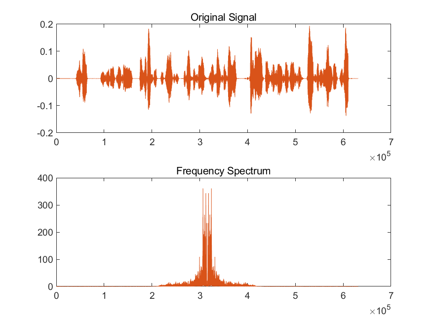
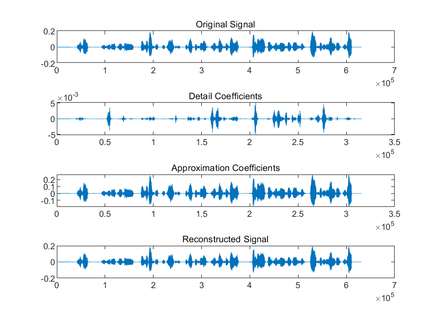
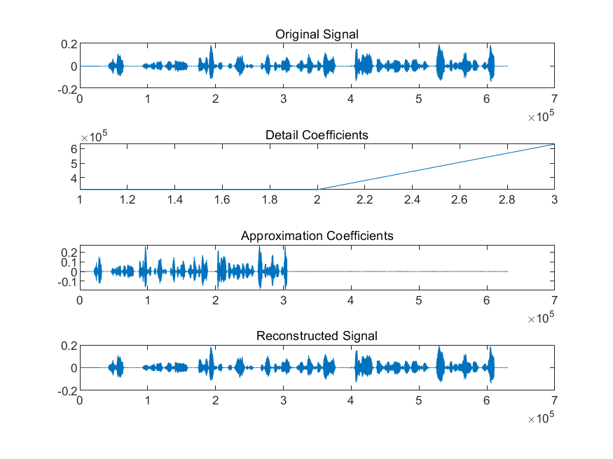
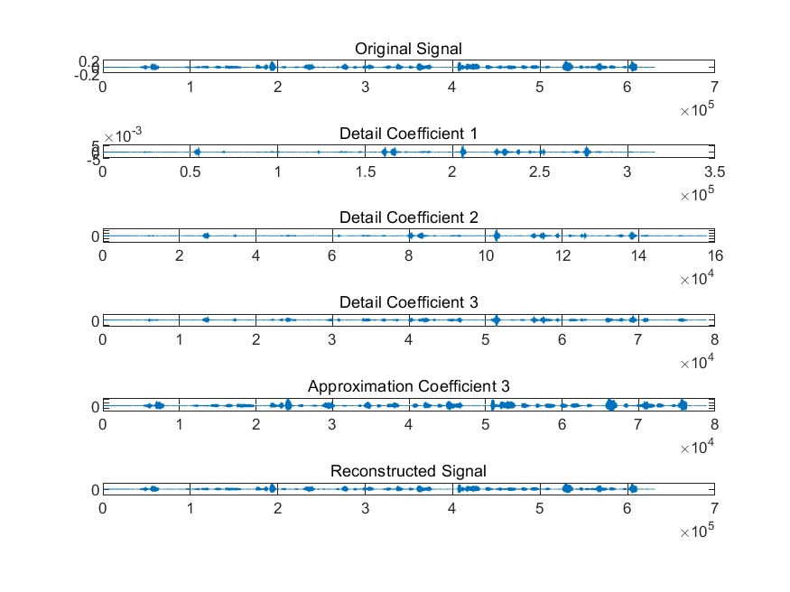
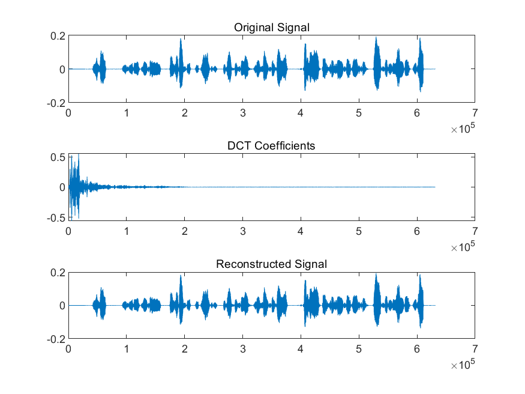

# <center>**信息隐藏技术实验报告**</center>

## <center>**Lab2 语音信号的处理**</center>

## <center> **网络空间安全学院 信息安全专业**</center>

## <center> **2112492 刘修铭 1028**</center>

# 一、题目

1. 学习慕课：2.2 语音信号处理基础
1. FFT
1. DWT
1. DCT

在 matlab 中调试完成课堂上的例题，练习使用常用的语音信号处理方法。


# 二、实验要求

编程实现，提交实验报告。

​	

# 三、实验原理

## （一）FFT

* 离散傅里叶变换
  $$
  X(k)=\Sigma^{N-1}_{n=0}x(n)e^{-j2\pi k\dfrac{n}{N}}\\
    x(n)=\dfrac{1}{N}\Sigma^{N-1}_{n=0}X(k)e^{j2\pi k\dfrac{n}{N}}
  $$


  * 把时域波形分解成许多不同频率的正弦波的叠加和

  * 傅里叶变换反映的是整个时间段中信号的频谱特性，信号任何时刻的微小变化都会影响到整个频谱

  * 任何有限频段上的信息都无法反映时域的某一个时间段的信号

  * 不合适：时变的、非平稳信号

* 短时傅里叶变换：对于时变的、非平稳信号，用窗口取得某一时间段的信号，再分析其频谱。
  $$
  STFT_x(t,f)=\int[x(t')g^*(t'-t)]e^{-j2\pi ft'}dt'
  $$

  * 取较窄的时间窗，可以得到较好的时间分辨率，但是其频率分辨率降低
  * 取较宽的时间窗，可以得到较高的频率分辨率，但是时域信号的细节特性就无法分辨
  * 短时傅里叶变换无法同时满足时间分辨率和频率分辨率的要求


## （二）DWT

小波变换（数学显微镜）：窗口大小（即窗口面积）固定但形状可变的时频局部化分析方法，引入了两个可变因子，平移与伸缩
$$
CWT_x(\tau,a)=\frac{1}{\sqrt{\left|a \right|}}\int x(t)h^*(\frac{t-\tau}{a})dt\\
x(t)=\frac{1}{C_H}\iint \frac{1}{a^2}CWT_x(\tau,a)\frac{1}{\sqrt{\left|a \right|}}h(\frac{t-\tau}{a})dadb
$$

> ${\sqrt{\left|a \right|}}h(\frac{t-\tau}{a})$ 为小波的平移与伸缩
>
> * 当尺度 $\alpha$ 增加时，表示以伸展了的 $h(t)$ 的波形取观察整个信号 $x(t)$
> * 当尺度 $\alpha$ 减小时，表示以缩窄了的 $h(t)$ 的波形取观察信号 $x(t)$ 的局部
> * 平移因子 $\tau$ 则是将扩展和缩窄了的小波沿着时间轴平移，以达到对整个时间段的覆盖和分析

* 在低频部分具有较高的频率分辨率，较低的时间分辨率
* 在高频部分具有较高的时间分辨率，较低的频率分辨率
* 多分辨率分析的直观含义：人观察目标，设他所处的尺度为 $j$，观察目标所获得的信息为 $V_j$
  * 当走近目标，即尺度增加到 $j + 1$，观察目标所获得的信息应该比尺度 $j$ 下获得的信息更为丰富，即 $V_j \subset V_{j+1}$。尺度越大，距离越近，信息越丰富；


## （三）DCT

离散余弦变换（DCT）

* 正变换：$T(u) = \Sigma^{N-1}_{x=0}f(x)g(x,u)\ \ u = 0,1,2,...,N-1$
  * 正变换核：$g(x,0)=\frac{1}{\sqrt{N}}\ \ g(x,u)=\sqrt{\frac{2}{N}}\cos{\frac{(2x+1)u\pi}{2N}}$
* 反变换：$f(x)=\frac{1}{\sqrt{N}}C(0)+\sqrt{\frac{2}{N}}\Sigma^{N-1}_{u=1}C(u)\cos{\frac{(2x+1)u\pi}{2N}}\ \ x=0,1,...,N-1$


# 四、实验过程（含主要源代码）

开始实验前，本人录制了一段音频作为本次实验的语料数据。

## （一）FFT

FFT 是快速傅里叶变换（Fast Fourier Transform）的缩写，是一种将信号从时域转换到频域的数学工具，可以将信号表示为一系列频率成分的组合。

按照慕课说明，代码实现如下：

> wavread 函数已无法使用，转用 audioread 函数替代

```matlab
clc;
clear all;
close all;

[x, fs] = audioread('./media/lxmliu2002.wav');
fx = fft(x); % fft 函数——快速傅里叶变换

subplot(2, 1, 1);
plot(x);
title('Original Signal');
subplot(2, 1, 2);
plot(abs(fftshift(fx))); % fftshift 函数——将频谱移到中心
title('Frequency Spectrum');
saveas(gcf, './pic/FFT.png');
```


## （二）DWT

DWT 是离散小波变换（Discrete Wavelet Transform）的缩写，通过将信号分解成不同频率的小波组分，使得可以在不同分辨率下分析信号。

### 1. dwt

使用 'db4'（Daubechies 4）小波基对信号进行一级小波变换。其中，cd1 是细节分量，ca1 是近似分量，a0 是重构后的结果。

```matlab
clc;
clear all;
close all;

[a, fs] = audioread('./media/lxmliu2002.wav');
plot(a)

[ca1, cd1] = dwt(a(:, 1), 'db4');
a0 = idwt(ca1, cd1, 'db4', length(a(:, 1)));
subplot(4, 1, 1);
plot(a(:, 1));
title('Original Signal');
subplot(4, 1, 2);
plot(cd1);
title('Detail Coefficients');
subplot(4, 1, 3);
plot(ca1);
title('Approximation Coefficients');
subplot(4, 1, 4);
plot(a0);
title('Reconstructed Signal');

saveas(gcf, './pic/DWT.png');
```

### 2. wavedec

使用 'db4'（Daubechies 4）小波基对信号进行三级小波变换。其中，cd1 是细节分量，ca1 是近似分量，a0 是重构后的结果。

```matlab
clc;
clear all;
close all;

[a, fs] = audioread('./media/lxmliu2002.wav');
plot(a)
title('Original Signal')

[ca1, cd1] = wavedec(a(:, 1), 1,'db4');
a0 = waverec(ca1, cd1, 'db4');
subplot(4, 1, 1);
plot(a(:, 1));
title('Original Signal')
subplot(4, 1, 2);
plot(cd1);
title('Detail Coefficients')
subplot(4, 1, 3);
plot(ca1);
title('Approximation Coefficients')
subplot(4, 1, 4);
plot(a0);
title('Reconstructed Signal')

saveas(gcf, './pic/Wavedec.png');
```

### 3. wavedec_3

使用 'db4'（Daubechies 4）小波基对信号进行一级小波变换。其中，cd1 是一级分解细节分量，cd2 是二级分解细节分量，cd3 是三级分解细节分量，ca3 是三级分解近似分量，a0 是重构后的结果。

```matlab
clc;
clear all;
close all;

[a, fs] = audioread('./media/lxmliu2002.wav');
plot(a)

[c,l]=wavedec(a(:,2),3 ,'db4') ;
ca3=appcoef(c,l,'db4',3) ;
cd3=detcoef(c,l,3) ;
cd2=detcoef(c,l,2) ;
cd1=detcoef(c,l,1) ;
a0=waverec(c,l,'db4') ;

subplot(6, 1, 1);
plot(a(:, 2));
title('Original Signal');
subplot(6, 1, 2);
plot(cd1);
title('Detail Coefficient 1');
subplot(6, 1, 3);
plot(cd2);
title('Detail Coefficient 2');
subplot(6, 1, 4);
plot(cd3);
title('Detail Coefficient 3');
subplot(6, 1, 5);
plot(ca3);
title('Approximation Coefficient 3');
subplot(6, 1, 6);
plot(a0);
title('Reconstructed Signal');

saveas(gcf, './pic/Wavedec_3.png');
```


## （三）DCT

DCT 是离散余弦变换（Discrete Cosine Transform）的缩写，将时域信号转换为频域信号。

```matlab
clc;
clear all;
close all;

[a, fs] = audioread('./media/lxmliu2002.wav');
plot(a)
title('Original Signal');

a1 = dct(a(:, 1));
a0 = idct(a1);
subplot(3, 1, 1);
plot(a(:, 1));
title('Original Signal');
subplot(3, 1, 2);
plot(a1);
title('DCT Coefficients');
subplot(3, 1, 3);
plot(a0);
title('Reconstructed Signal');

saveas(gcf, './pic/DCT.png');
```


# 五、实验结果及分析

## （一）FFT

如图，可以看到，经 FFT 处理后，语音信号的能力主要集中在 30kHz ~ 33kHz 附近。

1. 原始语音信号
2. FFT 变换信号



## （二）DWT

### 1. DWT

运行程序，得到如下的输出。

1. 原始语音信号
2. 一级分解的细节分量
3. 一级分解的近似分量
4. 重构信号



### 2. Wavedec

运行程序，得到如下的输出。

1. 原始语音信号
2. 一级分解的细节分量
3. 一级分解的近似分量，分解后数据的长度减半
4. 重构信号



### 3. Wavedec_3

运行程序，得到如下的输出。

1. 原始语音信号
2. 一级分解的细节分量
3. 二级分解的细节分量
4. 三级分解的细节分量
5. 按级分解的近似分量
6. 重构信号




## （三）DCT

运行程序，得到如下的输出。

1. 原始语音信号
2. DCT 变换信号
3. 重构信号




# 六、参考

本次实验主要参考慕课完成。


# 七、说明

本次实验所有代码均已放在 `codes` 文件夹下。

```shell
FFT.m
DWT.m
Wavedec.m
Wavedec_3.m
DCT.m
```

本人录制的音频为 `codes/media/lxmliu2002.wav`，本次实验所有图片均位于 `codes/pic` 文件夹