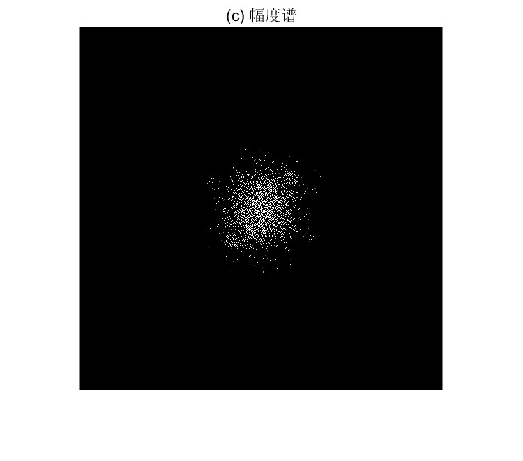
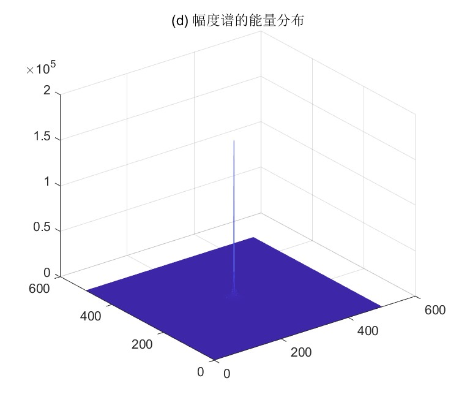
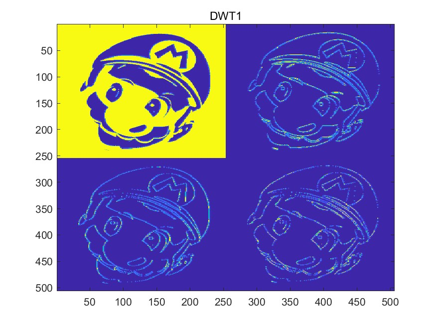
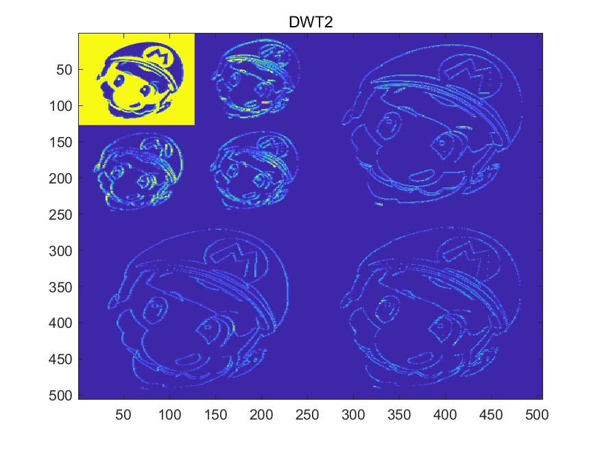
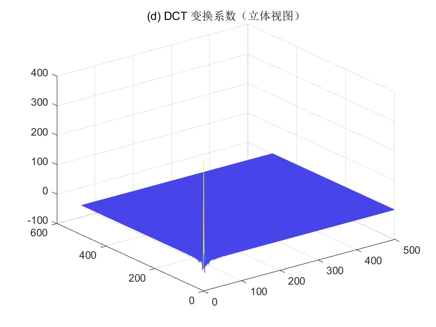

# <center>**信息隐藏技术实验报告**</center>

 <center>Lab3 图像信号的处理</center>

 <center> 网络空间安全学院 信息安全专业</center>

 <center> 2112492 刘修铭 1028</center>

## 题目

1. 学习慕课：2.2 语音信号处理基础
1. DFT
1. DWT
1. DCT

在 matlab 中调试完成课堂上的例题，练习使用常用的图像信号处理方法。


## 实验要求

编程实现，提交实验报告。

​	

## 实验原理

### DFT

* 正变换：$F(u,v)=\frac{1}{MN}\Sigma^{M-1}_{x=0}\Sigma^{N-1}_{y=0}f(x,y)e^{-j2\pi (\frac{ux}{M}+\frac{vy}{N})}\ \ u = 0,1,...,M-1\ \ v = 0,1,...,N-1$
* 反变换：$f(x,y)= \Sigma^{M-1}_{x=0}\Sigma^{N-1}_{y=0}F(u,v)e^{j2\pi (\frac{ux}{M}+\frac{vy}{N})}\ \ x = 0,1,...,M-1\ \ y = 0,1,...,N-1$
  * 幅度谱：$\left|F(u,v)\right|=[R^2(u,v)+I^2(u,v)]^{\frac{1}{2}}$
  * 相位谱：$\phi(u,v)=\arctan{\frac{I(u,v)}{R(u,v)}}$
* 特性
  * 线性性：$a_1f_1(x,y)+a_2f_2(x,y)\leftrightarrow a_1F_1(u,v)+a_2F_2(u,v)$
  * 比例性：$f(ax+by)\leftrightarrow \frac{1}{\left|ab\right|}F(\frac{u}{a},\frac{v}{b})$
  * 旋转不变性：图像的空间域 $f(x,y)$ 和频率域 $F(u,v)$ 可以分别用极坐标表示 $f(r,\theta)$ 和 $F(\omega,\phi)$：$f(r,\theta+\theta_0) \leftrightarrow F(\omega,\phi+\theta_0)$
  * 平均值（直流分量）：$F(0,0)=\frac{1}{N^2}\Sigma^{N-1}_{x=0}\Sigma^{N-1}_{y=0}f(x,y)$


### DWT

* * 正变换：$T(u,v)=\Sigma^{N-1}_{x=0}\Sigma^{N-1}_{y=0}f(x,y)g(x,y,u,v) \ \ g(x,y,0,0)=\frac{1}{N}\ \ g(x,y,u,v) = \frac{2}{N}\cos{\frac{(2x+1)u\pi}{2N}}\cos{\frac{(2y+1)v\pi}{2N}}$
  * 反变换：$f(x,y)=\Sigma^{N-1}_{u=0}\Sigma^{N-1}_{v=0}T(u,v)h(x,y,u,v)$
  * 2DCT 系数：$C(0,0)=\frac{1}{N}\Sigma^{N-1}_{x=0}\Sigma^{N-1}_{y=0}f(x,y)\ \ C(u,v)=\frac{2}{N}\Sigma^{N-1}_{x=0}\Sigma^{N-1}_{y=0}f(x,y)\cos{\frac{(2x+1)u\pi}{2N}}\cos{\frac{(2y+1)v\pi}{2N}}$
  * 重构：$f(x,y)=\frac{1}{N}C(0,0)+\frac{2}{N}\Sigma^{N-1}_{x=0}\Sigma^{N-1}_{y=0}C(u,v)\cos{\frac{(2x+1)u\pi}{2N}}\cos{\frac{(2y+1)v\pi}{2N}}$


### DCT

* 正变换：$T(u) = \Sigma^{N-1}_{x=0}f(x)g(x,u)\ \ u = 0,1,2,...,N-1$
  * 正变换核：$g(x,0)=\frac{1}{\sqrt{N}}\ \ g(x,u)=\sqrt{\frac{2}{N}}\cos{\frac{(2x+1)u\pi}{2N}}$
* 反变换：$f(x)=\frac{1}{\sqrt{N}}C(0)+\sqrt{\frac{2}{N}}\Sigma^{N-1}_{u=1}C(u)\cos{\frac{(2x+1)u\pi}{2N}}\ \ x=0,1,...,N-1$


## 实验过程（含主要源代码）

### DFT

离散傅立叶变换（DFT）是一种将离散的时间或空间域信号转换为离散频率域信号的技术。

按照慕课说明，代码实现如下：

```matlab
clc;
clear all;
close all;

b = imread("./pic/mario.jpeg"); % 读入图像，像素值在b中
b = rgb2gray(b); % 转换为灰度图像

figure(1);

imshow(b);
title("(a) 原图像");
imwrite(b,"./pic/2DFT/mario.jpeg");

figure(2);
I = im2bw(b);
imshow(I);
title("(b) 二值化图像");
imwrite(I,"./pic/2DFT/mario_bw.jpeg");


figure(3);
fa = fft2(I); % 使用 fft 函数进行快速傅里叶变换
ffa = fftshift(fa); % fftshift 函数调整 fft 函数的输出顺序，将零频位置移到频谱的中心

imshow(ffa,[200,225]); % 显示灰度在 200 − 255 之间的像
title("(c) 幅度谱");
saveas(gcf, "./pic/2DFT/mario_fft.jpeg");

figure(3);
l = mesh(abs(ffa)); % 画网格曲面图
title("(d) 幅度谱的能量分布");
saveas(gcf, "./pic/2DFT/mario_mesh.jpeg");
```


### DWT

DWT 是离散小波变换（Discrete Wavelet Transform）的缩写，通过将信号分解成不同频率的小波组分，使得可以在不同分辨率下分析信号。

#### 一级小波分解

`dwt2` 函数对二值图像 `a` 进行二维离散小波变换，使用 'db4' 小波。变换结果包括近似系数矩阵 `ca1`，水平细节系数矩阵 `ch1`，垂直细节系数矩阵 `cv1` 和对角线细节系数矩阵 `cd1`。`wcodemat` 函数将这些系数矩阵转换为可用于显示的编码矩阵，结果存储在 `cod_ca1`、`cod_ch1`、`cod_cv1` 和 `cod_cd1` 中。使用 `image` 函数将这四个编码矩阵组合并显示为图像。

```matlab
clc;
clear all;
close all;

b = imread("./pic/mario.jpeg"); % 读入图像，像素值在b中
a = im2bw(b);

nbcol = size(a,1);

[ca1, ch1, cv1, cd1] = dwt2(a, 'db4');
cod_ca1 = wcodemat(ca1, nbcol);
cod_ch1 = wcodemat(ch1, nbcol);
cod_cv1 = wcodemat(cv1, nbcol);
cod_cd1 = wcodemat(cd1, nbcol);

image([cod_ca1, cod_ch1; cod_cv1, cod_cd1]);
title("DWT1");
saveas(gcf, "./pic/DWT1.jpeg");
```

#### 二级小波分解

`dwt2` 函数对二值图像 `a` 进行第一次二维离散小波变换，使用 'db4' 小波。然后，对第一次变换的近似系数矩阵 `ca1` 进行第二次二维离散小波变换。`wcodemat` 函数将这些系数矩阵转换为可用于显示的编码矩阵。然后，将第二次变换的四个编码矩阵组合成一个矩阵 `tt`，并将其大小调整为 `ca1` 的大小。`image` 函数将 `tt` 和第一次变换的三个编码矩阵组合并显示为图像

```matlab
clc;
clear all;
close all;

b = imread("./pic/mario.jpeg"); % 读入图像，像素值在b中
a = im2bw(b);

nbcol = 512;
nbc = 256;

[ca1, ch1, cv1, cd1] = dwt2(a, 'db4');
[ca2, ch2, cv2, cd2] = dwt2(ca1, 'db4');

cod_ca1 = wcodemat(ca1, nbc);
cod_ch1 = wcodemat(ch1, nbc);
cod_cv1 = wcodemat(cv1, nbc);
cod_cd1 = wcodemat(cd1, nbc);

cod_ca2 = wcodemat(ca2, nbcol);
cod_ch2 = wcodemat(ch2, nbcol);
cod_cv2 = wcodemat(cv2, nbcol);
cod_cd2 = wcodemat(cd2, nbcol);

tt = [cod_ca2, cod_ch2; cod_cv2, cod_cd2];
tt = imresize(tt, size(ca1));

image([tt, cod_ch1; cod_cv1, cod_cd1]);
title("DWT2");
saveas(gcf, "./pic/DWT2.jpeg");
```


### DCT

DCT 是离散余弦变换（Discrete Cosine Transform）的缩写，将时域信号转换为频域信号。

```matlab
clc;
clear all;
close all;

b = imread("./pic/mario.jpeg"); % 读入图像，像素值在b中
b = rgb2gray(b); % 转换为灰度图像

figure(1);
imshow(b);
title("(a) 原图像");
imwrite(b,"./pic/2DCT/mario.jpeg");


I = im2bw(b);
figure(2);
imshow(I);
title("(b) 二值化图像");
imwrite(I,"./pic/2DCT/mario_bw.jpeg");

c = dct2(I); % 进行离散余弦变换
figure(3);
imshow(c);
title("(c) DCT 变换系数");
imwrite(c,"./pic/2DCT/mario_dct.jpeg");

figure(4);
mesh(c); % 画网格曲面图
title("(d) DCT 变换系数（立体视图）");
saveas(gcf, "./pic/2DCT/mario_mesh.jpeg");
```


## 实验结果及分析

### DFT

如图，这是处理前的彩色图像。


经过灰度处理后，得到如下图像。


接着进行二值处理，得到黑白二值图像。


经过处理后得到其幅度谱如下：



接着得到其幅度谱的能量分布，可以看到其能量主要集中在低频部分，小部分能量集中在中心。




### DWT

#### 一级小波分解

运行前面编写的程序，得到如下图像。可以看到，左上角为分解得到的近似分量，右上角为水平方向细节分量，左下角为垂直方向细节分量，右下角为对角线方向细节分量。



#### 二级小波分解

运行前面编写的程序，得到如下的图像。其处理过程基本相同，意即二级分解即对一级分解得到的近似分量进行二次分解，得到的波形大小为一级分解后的一半。




### DCT

如图，这是处理前的彩色图像。


经过灰度处理后，得到如下图像。


接着进行二值化，得到黑背二值图像。


调用 `dct` 函数进行离散余弦变换，得到其变换系数如下：


使用 `mesh` 函数画出变换后的系数的网格曲面图，可以看到，DCT 的系数主要集中在左上角，代表直流、低频系数，其余系数接近于零。




## 参考

本次实验主要参考慕课完成。


## 说明

本次实验所有代码均已放在 `codes` 文件夹下。

```shell
DCT.m
DFT.m
DWT1.m
DWT2.m
```

本次实验所有图片均位于 `codes/pic` 文件夹