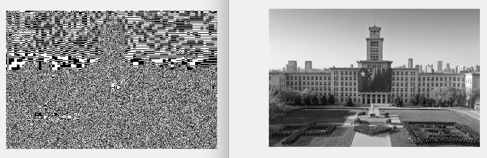
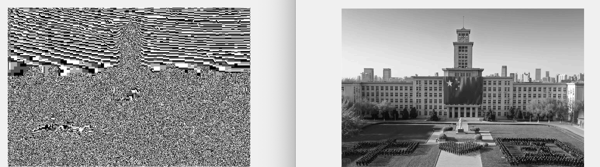
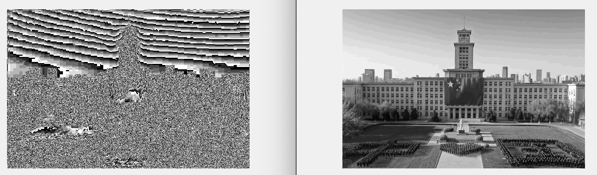
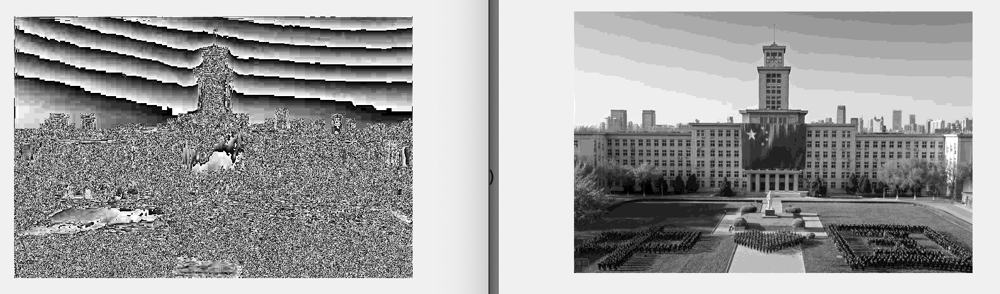
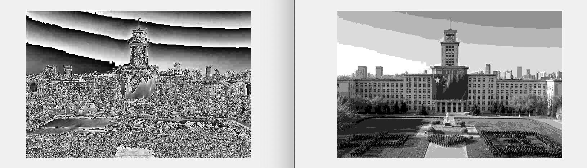
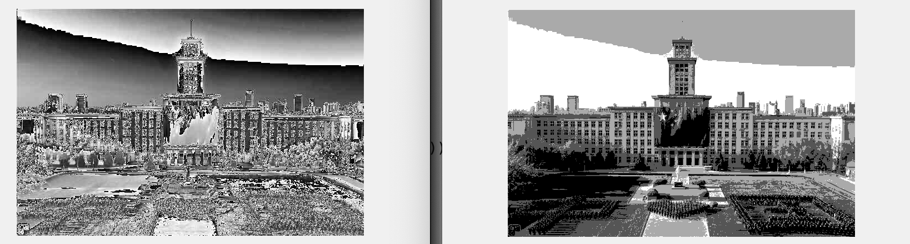
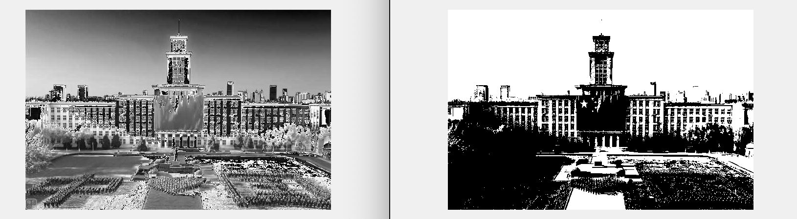

# <center>**信息隐藏技术实验报告**</center>

 <center>Lab5 图像的位平面实验</center>

 <center> 网络空间安全学院 信息安全专业</center>

 <center> 2112492 刘修铭 1028</center>

## 题目

### 回声信息隐藏

回声隐藏利用人耳听觉系统的时域掩蔽特性，在载体数据的环境特性(回声)中嵌入水印信息。掌握语音的回声隐藏算法原理，设计并实现一种回声隐藏算法。

### 图像的位平面实验

1. 实现对 1-8 任意位平面的提取并显示；
2. 实现对 1 \~ n 低位平面的图像显示和（n+1） \~ 8 高位平面的图像显示；
3. 实现去掉 1~n 位平面后的图像的显示。 


## 实验要求

两个题目任选其一，写出实验报告，含程序代码和截图，word 或 pdf 格式。

将实验报告、程序代码及相关文件打包压缩后（文件名命名方法：学号-姓名-图像的位平面实验），提交 qq 群作业。


## 实验原理

本次实验选择第二个题目，即图像的位平面实验。

### 图像位平面

数字图像中用来隐藏信息的位置：

> 主要考察像素的各个比特对图像的贡献：

* 贡献大的保留
* 贡献微弱的则可用于隐藏秘密信息的比特

图像的位平面概念：

* 图像的数据表示：

  * 8bit / 像素：256 色（0~255）

    * 各像素位置相同的位形成一个平面，称为“位平面”

    * 不同位平面的重要程度不同

      * 高位：图像信息

      * 低位：噪声

        > 人眼对随机噪声不敏感


## 实验过程（含主要源代码）

### 位平面提取

位平面算法：

* 相关函数

  * 获取图像 x 的行数和列数：[m, n] = size(x)
  * 提取 A 的第 bit 位的值：C = bitget(A, bit)
  * 将 A 的第 bit 位的值设为 v（v 的取值为 0 或 1）：C = bitset(A, bit, v)

```matlab
clc;
clear all;
close all;

figure;
img = imread("./pic/NKU70_gray.jpg");
imshow(img);
title('原图像');
imwrite(img, './pic/BMPbit1_8/NKU70_gray.bmp');

for t = 1 : 8
    [m, n] = size(img);
    c = zeros(m, n);
    for i = 1 : m
        for j = 1 : n
            c(i, j) = bitget(img(i, j), t);
        end
    end
    figure;
    imshow(c, []);
    title(['这是第', num2str(t), '个位平面']);
    imwrite(c, ['./pic/BMPbit1_8/NKU70_gray_bitplane_', num2str(t), '.bmp']);
end
```

### 位平面重构

本次实验中，本人尝试了生成图像的位平面图，并将位平面图重新构建成图像。

```matlab
clc;
clear all;
close all;

figure;
img = imread("./pic/NKU70_gray.jpg");
imshow(img);
title('原图像');
imwrite(img, './pic/BMPbit1_8_XtoY/NKU70_gray.bmp');

for t = 1 : 8
    [m, n] = size(img);
    x = zeros(m, n);
    y = zeros(m, n);
    z = zeros(m, n);
    for i = 1 : m
        for j = 1 : n
            x(i, j) = bitget(img(i, j), t);
        end
    end

    figure;
    imshow(x, []);
    title(['第 ', num2str(t), ' 个位平面']);
    imwrite(x, ['./pic/BMPbit1_8_XtoY/NKU70_gray_', num2str(t), '.png']);


    for k = 1 : t
        x = zeros(m, n);

        for i = 1 : m
            for j = 1 : n
                x(i, j) = bitget(img(i, j), k);
            end
        end

        for i = 1 : m
            for j = 1 : n
                y(i, j) = bitset(y(i, j), k, x(i, j));
            end
        end
    end

    figure;
    imshow(y, []);
    title(['第 1 - ', num2str(t), ' 个位平面']);
    imwrite(y, ['./pic/BMPbit1_8_XtoY/NKU70_gray_lo_', num2str(t), '_rebuild.png']);

    for k = t + 1 : 8
        x = zeros(m, n);
        for i = 1 : m
            for j = 1 : n
                x(i, j) = bitget(img(i, j), k);
            end
        end
        for i = 1 : m
            for j = 1 : n
                z(i, j) = bitset(z(i, j), k, x(i, j));
            end
        end
    end

    figure;
    imshow(z, []);
    title(['第 ', num2str(t) + 1, ' - 8 个位平面']);
    imwrite(z, ['./pic/BMPbit1_8_XtoY/NKU70_gray_hi_', num2str(t), '_rebuild.png']);
end
```

### 位平面去除

本次实验中，本人实现了去掉图像的最低位平面，并保存生成的新图像。

```matlab
clc;
clear all;
close all;

figure;
img = imread("./pic/NKU70_gray.jpg");
imshow(img);
title('原图像');
imwrite(img, './pic/REMOVEbit1_m/NKU70_gray.bmp');

for t = 1 : 7
    [m, n] = size(img);
    for k = 1 : t
        for i = 1 : m
            for j = 1 : n
                img(i, j) = bitset(img(i, j), k, 0);
            end
        end
    end

    figure;
    imshow(img, []);
    title(['去掉最低 ', num2str(t), ' 个位平面']);
    imwrite(img, ['./pic/REMOVEbit1_m/NKU70_gray_', num2str(t), '.bmp']);
end
```

### 基于位平面的图像隐藏

本次实验中，本人还实现了基于位平面的图像隐藏，即利用位平面的特性，将一个黑白二值图像隐藏在载体图像中。

低位平面承载的信息较少，嵌入后对载体图像的影响较小；高位平面承载的信息较多，可以保证隐藏图像的安全性。综合考虑后，在此，本人选择在第一位平面上进行隐藏。

```matlab
clc;
clear all;
close all;

figure;
image = imread('./pic/mario_gray.bmp');
imshow(image);
title('Original Image');
imwrite(image, './pic/HIDEbit/origional.bmp');

figure;
secret = imread('./pic/bird.bmp');
imshow(secret);
title('Secret Image');
imwrite(secret, './pic/HIDEbit/secret.bmp');

[m, n] = size(image);
for i = 1 : m
    for j = 1 : n
        image(i, j) = bitset(image(i, j), 1, secret(i, j));
    end
end

figure;
imshow(image, []);
title('Image with Secret Image');
imwrite(image, './pic/HIDEbit/withSecret.bmp');

[m, n] = size(image);
secretImage = zeros(m, n);
for i = 1 : m
    for j = 1 : n
        secretImage(i, j) = bitget(image(i, j), 1);
    end
end

figure;
imshow(secretImage, []);
title('Extracted Secret Image');
imwrite(secretImage, './pic/HIDEbit/extracted.bmp');
```


## 实验结果及分析

### 位平面提取

如图，这是处理前的原图。


运行前面编写好的程序，提取其位平面，得到如下 8 个位平面图（从上到下依次增大）。


观察生成的 8 个位平面的图片，可以发现，低位平面承载的信息较少，位平面越低图像越不规则。由于人眼对图像的变化不太敏感，尤其是对于最低位的微小变化，因此对低位平面进行一些修改通常不会导致明显的视觉质量下降，修改低位平面对图像的视觉效果影响较小，故而通常选取低位平面进行信息隐藏。而对于高位平面，可以观察到，其与原始图像的相似度较高。因为高位平面代表的是像素值的主要部分，修改它们可能导致图像的明显变化，这可能会降低图像的视觉质量。

### 位平面重构

如图，这是处理前的原图。


接着运行程序，对位平面进行重构，得到如下结果。下面图片中，左图为前 n 个位平面图叠加的结果，右图为后 n 个位平面图叠加的结果，可以看到，左图逐渐清晰，右图逐渐模糊。















综上可以发现，随着位平面的叠加，图像的清晰度逐渐提升。

### 位平面去除

如图，这是处理前的原图。


接着运行程序，逐步去除位平面，得到如下结果（从第一位平面开始，逐步去除位平面）。


可以看到，随着图像位平面的去除，图像的清晰度逐渐降低。

### 基于位平面的图像隐藏

如图，这是选定的载体图像。


这个是待隐藏的图像信息。


运行代码，得到如下装载后的图像。


由于本次选在最低位平面进行隐藏，故而可以看到装载后的图像较原图直观上看差别较小，不容易让人产生怀疑。

接着对装载后的图像进行提取，得到如下图片。


可以看到，提取出的图像与待隐藏的图像几乎完全一致，说明本次隐藏与提取过程完全成功。


## 参考

本次实验主要参考慕课完成。


## 说明

本次实验所有代码均已放在 `codes` 文件夹下。

```shell
BMPbit1_8.m
BMPbit1_8_XtoY.m
HIDEbit.m
REMOVEbit1_m.m
```

本次实验所有图片均位于 `codes/pic` 文件夹