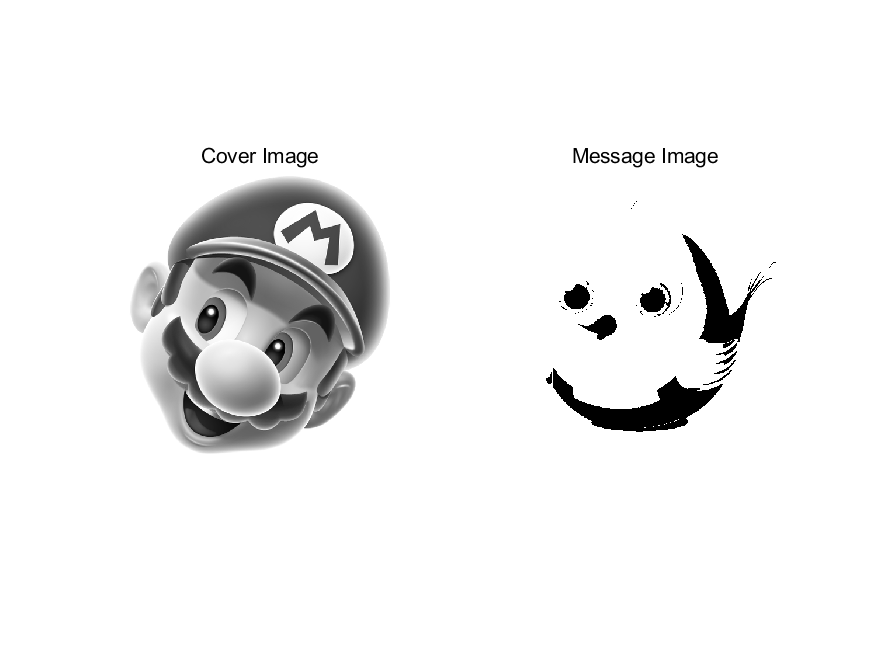
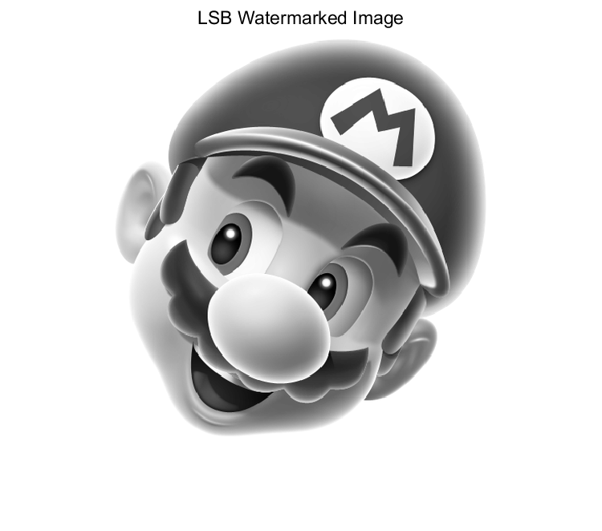
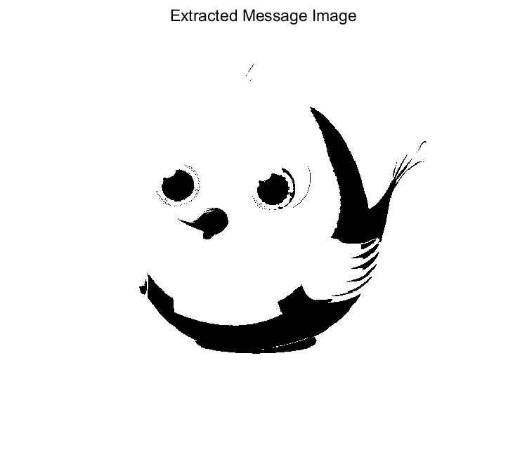
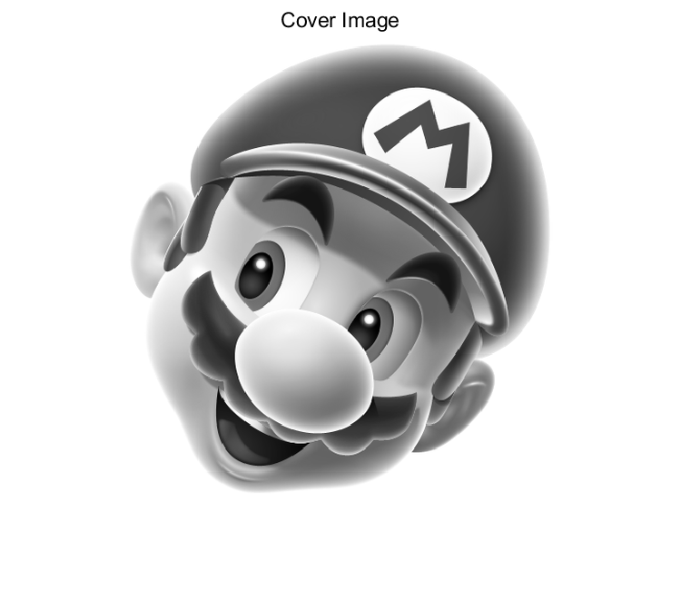
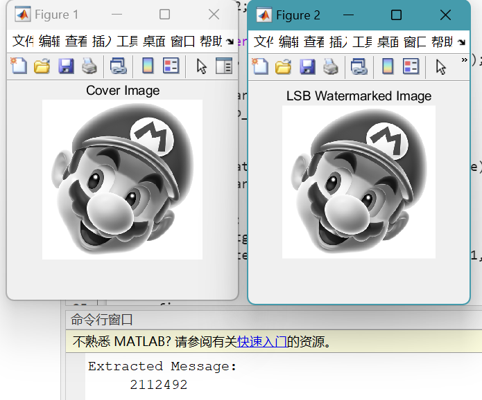

# <center>**信息隐藏技术实验报告**</center>

 <center>Lab6 LSB 隐藏法实验</center>

 <center> 网络空间安全学院 信息安全专业</center>

 <center> 2112492 刘修铭 1028</center>

## 题目

1. 实现将二值图像嵌入到位图中；

2. 实现将学号（一个整数）嵌入到位图中。 


## 实验要求

写出实验报告，含程序代码和截图，word 或 pdf 格式。将实验报告、程序代码及相关文件打包压缩后（文件名命名方法：学号 - 姓名 - 图像的 LSB 隐藏法实验），提交 qq 群作业。

​	

## 实验原理

LSB 方法：用秘密信息（比特）替换掉最低有效位的数据。

### 符号规定

* $c_i$：载体对象的取样值
* $s_i$：伪装对象的取样值
* $L(c)$：载体的长度
* $k$：伪装密钥

* $L(m)$：秘密信息的长度

### 流载体的 LSB 方法

* 嵌入：选择一个载体元素的子集 $\{j_1,j_2,...,j_{L(m)}\}$ ，其中共有 $L(m)$ 个元素，用以隐藏秘密信息的  $L(m)$ 个比特。然后在这个子集上执行替换操作，把 $c_{j_i}$ 的最低比特用 $m_i$ 来替换。
* 提取：找到嵌入信息的伪装元素的子集 $\{j_1,j_2,...,j_{L(m)}\}$，从这些伪装对象 $S_{j_i}$ 中抽出它们的最低比特位，排列之后组成秘密信息 $m$。

### 如何选择隐藏位置子集

* 顺序选取：发送者从载体的第一个元素开始，顺序选取 $L(m)$ 个元素作为隐藏的子集
  * 缺点：已经嵌入部分和未嵌入部分数据特征不同
    * 解决方法
      * 嵌入秘密信息后，继续嵌入伪随机序列
      * 重复嵌入秘密信息，直到载体结束
      * 随机间隔法：双方利用相同的伪随机数发生器和伪装密钥，确定隐藏位置
* 随机间隔：用伪装密钥 $k$ 作为 伪随机数发生器的种子，生成一个伪随机序列 $k_1,k_2,...,k_{L(m)}$，则嵌入位置为 $j_1=k_1,k_i=j_{i-1}+k_i(i\ge2)$

### 伪随机置换

能够得到载体的所有元素，就可以从整个载体考虑，把秘密信息比特随机地分散在整个载体中。

* 嵌入：用种子密钥产生一个伪随机序列 $\{j_1,j_2,...,j_{L(m)}\}$，将第 $k$ 个秘密信息比特隐藏在索引为 $j_k$ 的载体元素的最低比特位中。
* 提取：用同样的种子密钥产生相同的伪随机索引序列，从这些位置最低比特位中提取信息
* 应避免的问题：产生的索引值可能产生碰撞；用一个集合记录所有一使用过的载体索引值，当再次出现同样的索引值时，则放弃这个索引值，再选择下一个元素；提取时做同样处理

### LSB 方法的特点

* 优点：简单，易实现，容量大
* 缺点：安全性不高，不能抵抗叠加噪声、有损压缩等破坏

### 提高 LSB 方法的安全性的措施

* 对秘密信息先加密再隐藏
* 多次重复嵌入
* 引入纠错编码技术，先进行纠错编码，再进行隐藏


## 实验过程（含主要源代码）

### 对图像的信息隐藏

此处使用的原始图像与水印图像均为灰度图像，其中水印图像的大小为原始图像的一半。

#### Hide 函数

`Hide` 函数用于进行水印图像的装载。首先获取载体图像的尺寸，并创建一个与载体图像大小相同的空矩阵 `lsb_watermarked`，用于存储隐藏消息后的图像；接着遍历图像的每一个像素，对于图像中的每一个像素，将其最低位替换为水印图像中相应位置的像素值的最低位；最后作效果展示。该函数的核心是通过遍历图像的每个像素，将消息中每个像素值的最低位替换为图像中相应位置的像素值的最低位，从而实现消息的隐藏。

```matlab
function lsb_watermarked = Hide(cover, message)
    [Mc, Nc] = size(cover);
    lsb_watermarked = uint8(zeros(size(cover)));

    for i = 1 : Mc
        for j = 1 : Nc
            lsb_watermarked(i, j) = bitset(cover(i, j), 1, message(i, j));
        end
    end

    figure;
    imshow(lsb_watermarked);
    title('LSB Watermarked Image');
    saveas(gcf, './pic/LSB_img/lsb_watermarked.png');
end
```

#### Extract 函数

`Extract` 函数用于水印的提取。首先获取已经装载有水印的图像的尺寸，并创建一个与该图像大小相同的空矩阵 `message`，用于存储提取出的消息；接着遍历图像的每一个像素，对于图像中的每一个像素，提取其最低位，并存储到 `message` 中相应位置；最后显示提取出的消息图像。该函数的核心是通过遍历图像的每个像素，提取出每个像素值的最低位，从而得到隐藏在图像中的消息。

```matlab
function Extract(lsb_watermarked)
    [Mw, Nw] = size(lsb_watermarked);
    message = uint8(zeros(size(lsb_watermarked)));

    for i = 1 : Mw
        for j = 1 : Nw
            message(i, j) = bitget(lsb_watermarked(i, j), 1);
        end
    end

    figure;
    imshow(message, []);
    title('Extracted Message Image');
    saveas(gcf, './pic/LSB_img/extracted.png');
end
```

#### main 函数

`main` 函数对载体图像与水印图像进行初始化，并调用前面编写的两个函数进行水印的隐藏与提取。

```matlab
function main()
    clc;
    clear all;
    close all;

    figure;
    x = imread('./pic/mario_gray.bmp');
    m = imread('./pic/bird.bmp');
    subplot(1,2,1);
    imshow(x);
    title('Cover Image');
    subplot(1,2,2);
    imshow(m);
    title('Message Image');
    saveas(gcf, './pic/LSB_img/origional.png');

    lsb_watermarked = Hide(x, m);
    Extract(lsb_watermarked);
end
```

### 对数值（学号）的信息隐藏

#### Hide 函数

`Hide` 函数用于进行水印图像的装载。首先创建一个新的变量 `lsb_watermarked`，将输入的图像 `cover` 复制到这个变量中，以便进行消息隐藏操作。接下来使用一个循环遍历数字消息 `message` 中的每一位（假设数字消息是一个长度为 30 的向量，其中包含要隐藏的信息）。在每次迭代中，提取数字消息中的当前位，嵌入到图像的对应位置上。循环结束后，`lsb_watermarked` 中就嵌入了数字消息中的每一位。最后，显示隐藏消息后的图像。

```matlab
function lsb_watermarked = Hide(cover, message)
    lsb_watermarked = cover;

    for t = 1 : 30
        s = bitget(message, t);
        lsb_watermarked(1, t) = bitset(cover(1, t), 1, s);
    end

    figure;
    imshow(lsb_watermarked);
    title('LSB Watermarked Image');
    saveas(gcf, './pic/LSB_num/lsb_watermarked.png');
end
```

#### Extract 函数

`Extract` 函数用于水印的提取。首先创建一个空数组 `y` 用于存储提取出的数字消息。接下来通过一个循环遍历图像 `lsb_watermarked` 中的每一个像素的最低位，在每次迭代中提取图像中当前像素的最低位存储到数组 `y` 中的相应位置上。循环结束后，数组 `y` 中就存储了从图像中提取出的数字消息。最后，通过 `disp()` 函数将提取出的数字消息显示在命令行中。

```matlab
function Extract(lsb_watermarked)
    y = zeros(1);

    for t = 1 : 30
        k = bitget(lsb_watermarked(1, t), 1);
        y = bitset(y, t, k);
    end

    disp('Extracted Message:');
    disp(y);
end
```

#### main 函数

`main` 函数对载体图像与水印信息进行初始化，并调用前面编写的两个函数进行水印的隐藏与提取。

```matlab
function main()
    clc;
    clear all;
    close all;

    figure;
    x = imread('./pic/mario_gray.bmp');
    m = 2112492;
    imshow(x);
    title('Cover Image');
    saveas(gcf, './pic/LSB_num/origional.png');

    lsb_watermarked = Hide(x, m);
    Extract(lsb_watermarked);
end
```


## 实验结果及分析

### 对图像的信息隐藏

如图，这是选用的载体图像与水印图像。



接着运行代码，得到装载水印后的图像如下：



可以看到，与原始载体图像相差无几。这是因为我们本次使用 LSB 方法进行信息隐藏，而最低有效位承载的信息较少，对于图像的视觉效果影响较小。

接着提取水印，得到如下水印图像：



可以看到，成功提取出水印图像，与原始图像直观上看完全一致。

### 对数值（学号）的信息隐藏

如图，这是选用的载体图像：



此处选用本人学号 `2112492` 作为待隐藏的信息。

接着运行代码，得到装载信息的图像：


与前面相同的，可以看到其与原始载体图像直观上看差别较小，原因相同。

接着进行水印提取，得到如下结果：



可以看到，原始信息 `2112492` 提取成功。


## 参考

本次实验主要参考慕课完成。


## 说明

本次实验所有代码均已放在 `codes` 文件夹下。

```shell
LSB_img.m
LSB_num.m
```

本次实验所有图片均位于 `codes/pic` 文件夹