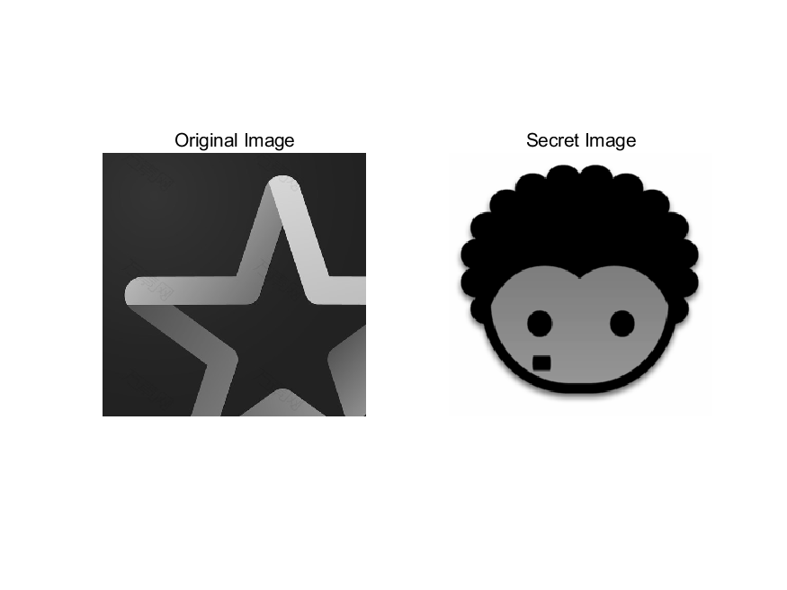
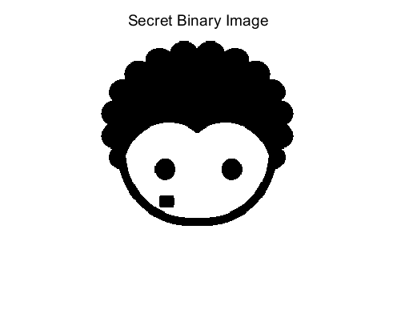
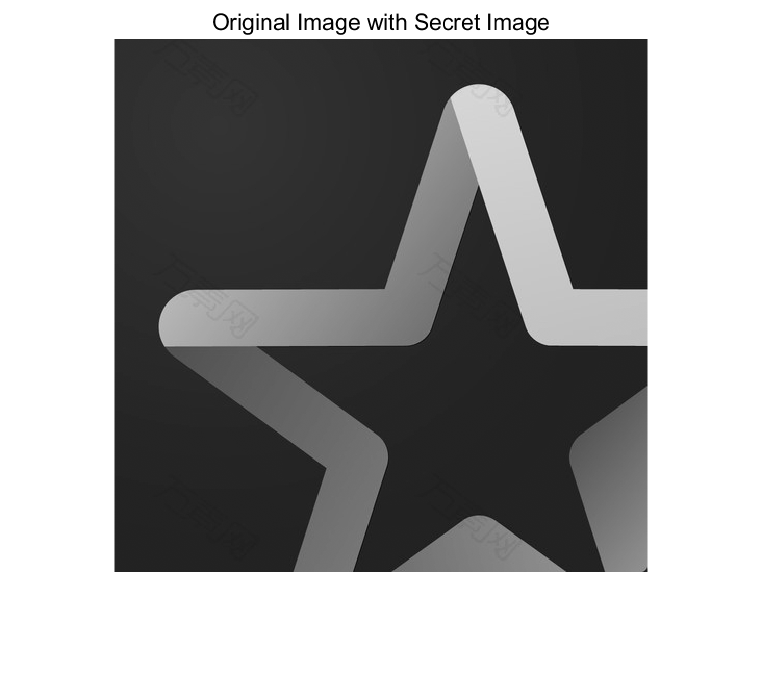

# <center>**信息隐藏技术实验报告**</center>

 <center>Lab7 奇偶校验位隐藏法实验</center>

 <center> 网络空间安全学院 信息安全专业</center>

 <center> 2112492 刘修铭 1028</center>

## 题目

1. 隐藏：利用奇偶校验位隐藏法，实现将秘密图像嵌入到位图中；
2. 提取：将秘密图像提取出来。


## 实验要求

写出实验报告，含程序代码和截图，word 或 pdf 格式。将实验报告、程序代码及相关文件打包压缩后（文件名命名方法：学号-姓名-奇偶校验位隐藏法实验），提交 qq 群作业。

​		

## 实验原理

奇偶校验位隐藏法主要有两种方法，其原理如下：

* 把载体划分成几个不相重叠的区域，在一个载体区域中存储一比特信息
  * 嵌入：选择 $L(m)$ 个不相重叠区域，计算出每一区域 $I$ 的所有最低比特的奇偶校验位（即 1 的个数奇偶性）$b_i(i = 1,2,...,n)$。$b_i=\Sigma_{j\in I}LSB(c_j)mod2$。嵌入信息时，在对应区域的奇偶校验位上嵌入信息比特 $m_i$，如果奇偶校验位 $b_i$ 与 $m_i$ 不匹配，则将该区域中所有元素的最低比特位进行反转，使得奇偶校验位与 $m_i$ 相同，即 $b_i=m_i$。
  * 提取：在接收端，收方与发放拥有共同的伪装密钥作为种子，可以伪随机地构造载体区域。收方从载体区域中计算出奇偶校验位，排列起来就可以重构秘密信息。
* 把载体划分成几个不相重叠的区域，在一个载体区域中存储一比特信息
  * 嵌入：选择 $L(m)$ 个不相重叠区域，计算出每一区域 $I$ 的所有最低比特的奇偶校验位（即 1 的个数奇偶性）$b_i(i = 1,2,...,n)$。$b_i=\Sigma_{j\in I}LSB(c_j)mod2$。区域 $I$ 隐藏一个信息比特。如果奇偶校验位 $b_i$ 与 $m_i$ 不匹配，则将该区域中**某个像素**的最低比特位进行反转，使得奇偶校验位与 $m_i$ 相同，即 $b_i=m_i$。
  * 提取：用同样的方法划分载体区域，计算出奇偶校验位，构成秘密信息。


## 实验过程（含主要源代码）

本次实验选用第二种方法进行完成。

### checksum 函数

`checksum` 函数用于计算特定一维向量的第 m 个区域的最低位的校验和。首先创建一个长度为 4 的临时数组 `temp` 用于存储第 m 个区域的四个像素的最低位。接下来使用 `bitget()` 函数分别从输入矩阵 `x` 的四个指定位置提取像素的最低位，并将其存储到临时数组 `temp` 中。然后，使用 `sum()` 函数计算 `temp` 数组的所有元素之和，再使用 `rem()` 函数计算该和除以2的余数，即为校验和。最后，将校验和作为函数的输出返回。该函数的核心是通过提取指定区域的四个像素的最低位，并计算它们的和的奇偶性来生成校验和。

```matlab
function result = checksum(x, i, j)
    % 计算特定一维向量的第 m 个区域的最低位的校验和
    temp = zeros(1, 4);
    temp(1) = bitget(x(2 * i - 1, 2 * j - 1), 1); 
    temp(2) = bitget(x(2 * i - 1, 2 * j), 1); 
    temp(3) = bitget(x(2 * i, 2 * j - 1), 1); 
    temp(4) = bitget(x(2 * i, 2 * j ), 1); 
    result = rem(sum(temp), 2); 
end
```

### Hide 函数

`Hide` 函数用于基于奇偶校验和进行信息隐藏。首先循环遍历输入矩阵 `x` 的每个区域，通过 `checksum()` 函数计算每个区域的校验和，并与目标校验和 `y` 进行比较。如果某个区域的校验和与目标校验和不匹配，则说明需要修改该区域的像素值来满足校验和。在修改的时候，借助随机数对方块内随机像素的最低比特位进行异或取反。继续循环遍历，直到所有区域的校验和与目标校验和匹配。最后返回修改后的矩阵作为输出结果。

```matlab
function result = Hide(x, m, n, y)
    for i = 1 : m 
        for j = 1 : n 
            if checksum(x, i, j) ~= y(i, j)
                random = int8(rand() * 3); 
                switch random
                    case 0
 					    x(2 * i - 1, 2 * j - 1) = bitset(x(2 * i - 1, 2 * j - 1), 1, ~ bitget(x(2 * i - 1, 2 * j - 1), 1)); 
                    case 1 
 					    x(2 * i - 1, 2 * j) = bitset(x(2 * i - 1, 2 * j), 1, ~ bitget(x(2 * i - 1, 2 * j), 1)); 
                    case 2
 					    x(2 * i, 2 * j - 1) = bitset(x(2 * i, 2 * j - 1), 1, ~ bitget(x(2 * i, 2 * j - 1), 1)); 
                    case 3
 					    x(2 * i, 2 * j) = bitset(x(2 * i, 2 * j), 1, ~ bitget(x(2 * i, 2 * j), 1)); 
                end
            end
        end
    end
    result = x;
end
```

### Extract 函数

`Extract` 函数用于从带有秘密信息的图像中提取出秘密信息。首先使用 `size()` 函数获取带有秘密信息的图像的尺寸，并将其存储在变量 `m` 和 `n` 中。接着创建一个大小为原始图像一半的空矩阵 `secret`，用于存储提取的秘密信息。循环遍历带有秘密信息的图像的每个区域（每个区域为 $2 \times 2$ 像素），对每个区域调用 `checksum()` 函数，计算其校验和，并将校验和存储在 `secret` 矩阵相应位置。循环结束后，将 `secret` 矩阵作为函数的输出结果返回。这个函数的主要思路是通过计算每个区域的校验和来提取带有秘密信息的图像中的秘密信息。

```matlab
function result = Extract(original_with_secret)
    [m, n]= size(original_with_secret); 
    secret = zeros(m / 2, n / 2); 
    for i = 1 : m / 2
        for j = 1: n / 2
            secret(i, j) = checksum(original_with_secret, i, j); 
        end 
    end 
    result = secret;
end
```


## 实验结果及分析

如下是本次实验用到的原始图像与待装载的秘密图像。



运行程序，得到黑白二值化的秘密图像。



接着运行程序，得到装载秘密图像后的载体图像。



最后提取水印，得到秘密图像：


可以看到，其与原始图像直观上基本相似，说明提取成功。


## 参考

本次实验主要参考慕课完成。


## 说明

本次实验所有代码均已放在 `codes` 文件夹下。

```shell
Process.m
```

本次实验所有图片均位于 `codes/pic` 文件夹