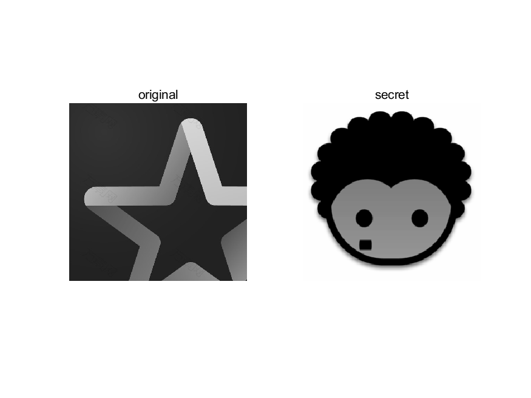

# <center>**信息隐藏技术实验报告**</center>

 <center>Lab8 二值图像信息隐藏法实验</center>

 <center> 网络空间安全学院 信息安全专业</center>

 <center> 2112492 刘修铭 1028</center>

## 题目

1. 隐藏：利用二值图像隐藏法，实现将秘密信息（可以是图像、文字等信息）嵌入到位图中；

2. 提取：将秘密信息提取出来。


## 实验要求

写出实验报告，含程序代码和截图，word 或 pdf 格式。将实验报告、程序代码及相关文件打包压缩后（文件名命名方法：学号-姓名-二值图像隐藏法实验），提交 qq 群作业。

​	

## 实验原理

二值图像由黑白两种颜色的像素组成，通常利用图像区域中黑色像素个数相对于区域中全部像素个数的百分比来对秘密信息进行编码。

Zhao-Koch 方案

* 嵌入：把一个二值图像分成 $L(m)$ 个矩阵图像区域 $B_i$，如果其中黑色像素的个数大于一般，则表示嵌入 0；如果白色像素的个数大于一半，则表示嵌入 1。当需要嵌入的比特与所选区域的黑白像素的比例不一致时，为了达到希望的像素关系，则需要修改一些像蛇的颜色。修改赢遵循一定的规则，原则是不引起感观察觉，修改应在黑白区域的边缘进行。

* 需注意的细节：选择图像块时，应考虑有一定的冗余度，确定有效区域：

  * 确定两个阈值 $R_1>50\%$ 和 $R_0<50\%$，以及一个健壮性参数 $\lambda$
  * 隐藏 0 时，该块的黑色像素的个数应属于 $[R_1,R_1+\lambda]$
  * 隐藏 1 时，该块的黑色像素的个数应属于 $[R_0-\lambda,R_0]$

* 标识无效块：如果为了适应所嵌入的比特，目标块必须修改太多的像素，就把该块设为无效

  * 将无效块中的像素进行少量的修改，使得其中黑色像素的百分比大于 $R_1+3\lambda$，或者小于 $R_0-3\lambda$

* 提取：判断每一个图像块黑色像素的百分比，如果大于 $R_1+3\lambda$，或者小于 $R_0-3\lambda$，则跳过这样的无效块；如果在 $[R_1,R_1+\lambda]$ 或 $[R_0-\lambda,R_0]$ 的范围内，则正确提取出秘密信息 0 或 1。

* 简易算法：将原图划分为 $1\times4$ 的矩形像素块，每个区域有四个连续的像素点。这些像素点的取值情况可以分为 5 类：全白，1 个黑像素点，2 个黑像素点，3 个黑像素点和全黑。

  | 黑像素个数 |   0    |     1     |     2     |     3     |   4    |
  | :--------: | :----: | :-------: | :-------: | :-------: | :----: |
  |  像素分布  |  全白  | 1 黑 3 白 | 2 黑 2 白 | 3 黑 1 白 |  全黑  |
  |    含义    | 无效块 |  隐藏 1   | 不能出现  |  隐藏 0   | 无效块 |

  > 要隐藏的信息位文本文档中的字符串，需注意：
  >
  > * 嵌入的信息长度不能过大，不能超过图片大小所能负担的度量
  > * 为了简化过程，可以规定接收者已知秘密信息的长度

  * 嵌入：遍历原图中的每个 $1\times4$ 矩阵区域

    * 如果要嵌入的信息为 0，则需要将当前区域的黑像素点数量调整到 3 个
      * 如果当前区域黑像素点数量正好为 3 个，则不需要修改
      * 如果当前区域黑像素点数量为 1 或 2 或 4 个，则需要进行修改，使其黑色像素点数量变为 3 个，同时要注意的是，对原有黑色像素直接利用，位置不做修改，为的是嵌入秘密信息的过程中，对图片的修改尽量少
      * 如果原区域全白，则舍弃这一块不做修改，否则变化可能被直观视觉所感受到
    * 如果要嵌入的信息为 1，则需要将当前区域的黑像素点数量调整到 1 个
      * 如果当前区域黑像素点数量正好为 1 个，则不需要修改
      * 如果当前区域黑像素点数量为 0 或 2 或 3 个，则需要进行修改，使其黑色像素点数量变为 1 个，同时要注意的是，对原有黑色像素直接利用，多余的翻转为白像素，为的是嵌入秘密信息的过程中，对图片的修改尽量少
      * 如果原区域全黑，则舍弃这一块不做修改，否则变化可能被直观视觉所感受到

  * 提取：嵌入过信息的图像中每个区域的黑色像素点个数只有 4 个取值：0、1、3、4.遍历携带图像的每个 $1\times4$ 区域，如果黑色像素点个数为 1 或 3 则提取信息，1 个黑像素点对应 1，3 个黑像素点对应 0，其余为为嵌入信息的区域。

游程编码：

* 编码：$<a_0, 3><a_1,5><a_2,4><a_3,2><a_4,1>$
* 嵌入：修改二值图像的游程长度
  * 如果秘密信息位是 0，则修改该游程长度为偶数
  * 如果为 1，则修改为奇数
  * 如果秘密信息的取值与游程长度的奇偶性想匹配，则不改变游程长度
* 提取：根据游程长度的奇偶性提取出秘密信息


## 实验过程（含主要源代码）

本次实验中，使用二值图像隐藏法对图片进行隐藏与提取。

### BlackNum 函数

BlackNum 函数用于计算一个二进制图像中指定位置周围的黑色像素数量，用于确定在隐藏或提取图像时应该如何隐藏或提取像素值。

```matlab
function blackCount = BlackNum(imageMatrix, row, col) 
    [~, n] = size(imageMatrix);
    halfWidth = n / 2;
    positionInRow = (row - 1) * halfWidth + col;
    positionInMatrix = positionInRow * 4 - 3;
    matrixRow = idivide(int32(positionInMatrix), int32(n), "ceil");
    matrixCol = positionInMatrix - (matrixRow - 1) * n;
    blackCount = 0;
    for t = 0 : 3
        if imageMatrix(matrixRow, matrixCol + t) == 0
            blackCount = blackCount + 1;
        end
    end
end
```

### changeToZero 函数

changeToZero 函数根据不同的条件将指定位置周围的像素值修改为零或者一个特定的值，用于在隐藏图像时根据一定规则修改原始图像中的像素值。具体来说，在 `Hide` 函数中，当需要将秘密图像的黑色像素（值为1）嵌入到原始图像中时，会调用 `changeToZero` 函数。该函数根据参数 `tmp` 的不同取值，执行不同的操作：

- 如果 `tmp` 为 1，函数会随机选择两个不同的位置，如果这些位置的像素值为 1（黑色），则将其中一个位置的像素值修改为 0（白色）。
- 如果 `tmp` 为 2，函数会随机选择一个位置，如果该位置的像素值为 1（黑色），则将其像素值修改为 0（白色）。
- 如果 `tmp` 为 4，函数会随机选择一个位置，并将其像素值修改为 1（黑色）。

```matlab
function result = changeToZero(imageMatrix, row, col, tmp)
    [~, n] = size(imageMatrix);
    halfWidth = n / 2;
    positionInRow = (row - 1) * halfWidth + col;
    positionInMatrix = positionInRow * 4 - 3;
    matrixRow = idivide(int32(positionInMatrix), int32(n), "ceil");
    matrixCol = positionInMatrix - (matrixRow - 1) * n;
    
    if tmp == 1
        rand1 = int8(rand() * 2 + 1);
        rand2 = int8(rand() * 2 + 1);
        while rand1 == rand2
            rand1 = int8(rand() * 2 + 1);
            rand2 = int8(rand() * 2 + 1);
        end

        t = 0;
        for q = 0 : 3
            if imageMatrix(matrixRow, matrixCol + q) == 1
                t = t + 1;
                if t == rand1 || t == rand2
                    imageMatrix(matrixRow, matrixCol + q) = 0;
                end
            end
        end

    elseif tmp == 2
        randk = int8(rand() + 1);
        t = 0;
        for q = 0 : 3
            if imageMatrix(matrixRow, matrixCol + q) == 1
                t = t + 1;
                if t == randk
                    imageMatrix(matrixRow, matrixCol + q) = 0;
                end
            end
        end

    elseif tmp == 4
        randk = int32(rand() * 3);
        imageMatrix(matrixRow, matrixCol + randk) = 1;
    end
    
    result = imageMatrix;
end
```

### changeToOne 函数

changeToOne 函数与 `changeToZero` 函数类似，不同之处在于修改的像素值为1或者0，以及修改条件的选择方式不同，其是根据不同的条件将指定位置周围的像素值修改为 1 或者特定的值，用于在隐藏图像时根据一定规则修改原始图像中的像素值。

具体来说，在 `Hide` 函数中，当需要将秘密图像的白色像素（值为0）嵌入到原始图像中时，会调用 `changeToOne` 函数。该函数根据参数 `tmp` 的不同取值，执行不同的操作：

- 如果 `tmp` 为 0，函数会随机选择一个位置，并将其像素值修改为 0（白色）。
- 如果 `tmp` 为 2，函数会随机选择一个位置，如果该位置的像素值为 0（白色），则将其像素值修改为 1（黑色）。
- 如果 `tmp` 为 3，函数会随机选择两个不同的位置，如果这些位置的像素值为 0（白色），则将其中一个位置的像素值修改为 1（黑色）。

```matlab
function result = changeToOne(imageMatrix, row, col, tmp)
    [~, n] = size(imageMatrix);
    halfWidth = n / 2;
    positionInRow = (row - 1) * halfWidth + col;
    positionInMatrix = positionInRow * 4 - 3;
    matrixRow = idivide(int32(positionInMatrix), int32(n), "ceil");
    matrixCol = positionInMatrix - (matrixRow - 1) * n;
    
    if tmp == 0
        randk = int32(rand() * 3);
        imageMatrix(matrixRow, matrixCol + randk) = 0;

    elseif tmp == 2
        randk = int8(rand() + 1);
        t = 0;
        for q = 0 : 3
            if imageMatrix(matrixRow, matrixCol + q) == 0
                t = t + 1;
                if t == randk
                    imageMatrix(matrixRow, matrixCol + q) = 1;
                end
            end
        end

    elseif tmp == 3
        rand1 = int8(rand() * 2 + 1);
        rand2 = int8(rand() * 2 + 1);
        while rand1 == rand2
            rand1 = int8(rand() * 2 + 1);
            rand2 = int8(rand() * 2 + 1);
        end

        t = 0;
        for q = 0 : 3
            if imageMatrix(matrixRow, matrixCol + q) == 0
                t = t + 1;
                if t == rand1 || t == rand2
                    imageMatrix(matrixRow, matrixCol + q) = 1;
                end
            end
        end

    end
    result = imageMatrix;
end
```

### Hide 函数

Hide 函数将一个二进制秘密图像隐藏到另一个二进制原始图像中。

1. **遍历原始图像**：
   - 使用嵌套的循环遍历原始图像中的每个像素位置。
2. **计算黑色像素数量**：
   - 对于每个像素位置，调用 `BlackNum` 函数计算其周围的黑色像素数量。
3. **根据秘密图像值进行修改**：
   - 如果秘密图像中当前位置的值为 0（白色），则根据周围的黑色像素数量来决定是否需要修改原始图像中的像素值为0（白色）。
     - 如果周围的黑色像素数量为 1、2 或 4，则调用 `changeToZero` 函数将当前位置的像素值修改为 0（白色）。
   - 如果秘密图像中当前位置的值为 1（黑色），则根据周围的黑色像素数量来决定是否需要修改原始图像中的像素值为1（黑色）。
     - 如果周围的黑色像素数量为 0、2 或 3，则调用 `changeToOne` 函数将当前位置的像素值修改为 1（黑色）。
4. **返回修改后的图像矩阵**：
   - 返回经过修改后的图像矩阵 `imageMatrix`，其中已经隐藏了秘密图像。

```matlab
function result = Hide(imageMatrix, numRows, numCols, secretMatrix)
    for i = 1 : numRows
        for j = 1 : numCols
            blackCount = BlackNum(imageMatrix, i, j);
            if secretMatrix(i, j) == 0
                if blackCount == 1 || blackCount == 2 || blackCount == 4
                    imageMatrix = changeToZero(imageMatrix, i, j, blackCount);
                end
            elseif secretMatrix(i, j) == 1
                if blackCount == 0 || blackCount == 2 || blackCount == 3
                    imageMatrix = changeToOne(imageMatrix, i, j, blackCount);
                end
            end
        end
    end

    result = imageMatrix;
end
```

### Extract 函数

Extract 函数从隐写术修改过的图像中提取隐藏的秘密图像。

1. **确定结果图像大小**：
   - 获取输入图像 `originalWithSecret` 的大小，并将结果图像 `result` 初始化为相应大小的零矩阵。这个大小是原始图像的一半大小，因为每个像素位置代表了隐写术修改后的图像中的一个像素。
2. **遍历隐写术修改过的图像**：
   - 使用嵌套的循环遍历隐写术修改过的图像中的每个像素位置。
3. **根据黑色像素数量确定提取结果**：
   - 对于每个像素位置，调用 `BlackNum` 函数计算其周围的黑色像素数量。
   - 根据计算得到的黑色像素数量，确定提取结果图像中当前位置应该是白色（0）还是黑色（1）：
     - 如果黑色像素数量为 1，则将结果图像中当前位置的值设置为 1（黑色）。
     - 如果黑色像素数量为 3，则将结果图像中当前位置的值设置为 0（白色）。
     - 如果黑色像素数量为 0 或 4，则根据具体情况将结果图像中当前位置的值设置为 0 或 1。
4. **返回提取结果**：
   - 返回提取出的秘密图像 `result`。

```matlab
function result = Extract(originalWithSecret)
    [m, n] = size(originalWithSecret); 
    result = zeros(m / 2, n / 2);

    for i = 1 : m / 2
        for j = 1 : n / 2
            blackCount = BlackNum(originalWithSecret, i, j);
            if blackCount == 1
                result(i, j) = 1;
            elseif blackCount == 3
                result(i, j) = 0;
            elseif blackCount == 0
                result(i, j) = 0;
            elseif blackCount == 4
                result(i, j) = 1;
            end
        end 
    end
end
```


## 实验结果及分析

如图是本次实验中用到的原始图像和待隐藏的图像。



如图，是进行二值化处理后的两个图像。


接着运行程序，对秘密图像进行隐藏，得到下面的结果。但是由于图像的信息含量较少，可以看到加密后效果不是很好，能够看到加密图像的影子，容易引起攻击者怀疑。


最后进行提取，得到如下秘密图像。可以看到，加密的图像得以成功提取，与原始图像相比，完全相同。


## 参考

本次实验主要参考慕课完成。


## 说明

本次实验所有代码均已放在 `codes` 文件夹下。

```shell
Process.m
```

本次实验所有图片均位于 `codes/pic` 文件夹